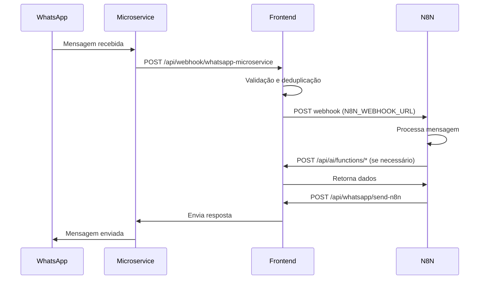

# 📊 Status da Integração N8N

## ✅ O que está pronto

### 1. **Webhook de Recebimento** (`/api/webhook/whatsapp-microservice`)
- ✅ Recebe mensagens do microserviço WhatsApp
- ✅ Valida autenticação (API Key ou HMAC)
- ✅ Sistema de deduplicação de mensagens
- ✅ Encaminha mensagens para N8N
- ✅ Logs detalhados

### 2. **Endpoint de Envio** (`/api/whatsapp/send-n8n`)
- ✅ Recebe respostas do N8N
- ✅ Valida autenticação via API Key
- ✅ Envia mensagens via WhatsApp Client
- ✅ Suporte a texto e mídia
- ✅ Validação de schema com Zod

### 3. **APIs CRUD** (`/api/ai/functions/*`)
- ✅ Todas as 20+ funções disponíveis
- ✅ Prontas para serem chamadas pelo N8N
- ✅ Isolamento por tenant

### 4. **Endpoint de Teste** (`/api/n8n/test`)
- ✅ GET: Verifica configuração
- ✅ POST: Simula envio de mensagem

## ❌ O que falta configurar

### 1. **Variáveis de Ambiente**
Adicione ao seu `.env.local`:

```bash
# N8N Webhook
N8N_WEBHOOK_URL=https://seu-n8n.com/webhook/xxxxx
N8N_WEBHOOK_SECRET=seu-secret-compartilhado
N8N_API_KEY=chave-para-n8n-chamar-frontend

# WhatsApp Microservice
WHATSAPP_MICROSERVICE_URL=http://localhost:3001
WHATSAPP_MICROSERVICE_API_KEY=chave-do-microservice
WHATSAPP_WEBHOOK_SECRET=secret-para-hmac
```

### 2. **Configuração no N8N**

#### Webhook Trigger (Receber mensagens)
```javascript
// Configurar no N8N Webhook node
{
  "httpMethod": "POST",
  "path": "whatsapp-messages",
  "responseMode": "onReceived",
  "responseData": "{ \"success\": true }"
}

// Validar header x-webhook-signature
if (headers['x-webhook-signature'] !== 'seu-secret-compartilhado') {
  throw new Error('Invalid signature');
}
```

#### HTTP Request (Enviar resposta)
```javascript
// Node HTTP Request no N8N
{
  "method": "POST",
  "url": "https://seu-frontend.com/api/whatsapp/send-n8n",
  "headers": {
    "Authorization": "Bearer {{N8N_API_KEY}}",
    "Content-Type": "application/json"
  },
  "body": {
    "tenantId": "{{tenantId}}",
    "clientPhone": "{{clientPhone}}",
    "finalMessage": "{{resposta}}",
    "mediaUrl": "{{urlDaImagem}}" // opcional
  }
}
```

#### Chamadas para Funções CRUD
```javascript
// Exemplo: Buscar propriedades
{
  "method": "POST",
  "url": "https://seu-frontend.com/api/ai/functions/search-properties",
  "headers": {
    "Content-Type": "application/json"
  },
  "body": {
    "tenantId": "{{tenantId}}",
    "location": "{{location}}",
    "bedrooms": {{bedrooms}},
    "maxPrice": {{maxPrice}}
  }
}
```

## 🧪 Como testar

### 1. **Verificar Configuração**
```bash
curl http://localhost:3000/api/n8n/test
```

### 2. **Simular Mensagem (sem enviar)**
```bash
curl -X POST http://localhost:3000/api/n8n/test \
  -H "Content-Type: application/json" \
  -d '{
    "tenantId": "test-tenant",
    "message": "Olá, teste!",
    "simulate": true
  }'
```

### 3. **Enviar Mensagem Real para N8N**
```bash
curl -X POST http://localhost:3000/api/n8n/test \
  -H "Content-Type: application/json" \
  -d '{
    "tenantId": "test-tenant",
    "message": "Mensagem de teste real",
    "simulate": false
  }'
```

## 📝 Fluxo Completo



## 🔍 Debug e Logs

### Frontend
```bash
# Ver logs do frontend
tail -f logs/app.log

# Logs específicos do N8N
grep "N8N" logs/app.log
```

### Verificar Headers
```bash
# No N8N, verificar headers recebidos
console.log('Headers:', $input.all()[0].headers);
console.log('Body:', $input.all()[0].json);
```

## ⚠️ Problemas Comuns

### 1. N8N não recebe mensagens
- Verifique `N8N_WEBHOOK_URL` está correto
- Confirme que N8N está acessível da internet
- Verifique logs do frontend para erros

### 2. Resposta não chega no WhatsApp
- Verifique `N8N_API_KEY` está correto
- Confirme que o WhatsApp está conectado
- Verifique logs em `/api/whatsapp/send-n8n`

### 3. Funções CRUD retornam erro
- Sempre incluir `tenantId` no body
- Verificar formato dos parâmetros
- Consultar logs específicos da função

## 📊 Monitoramento

### Endpoints de Status
- `GET /api/n8n/test` - Configuração geral
- `GET /api/whatsapp/session` - Status WhatsApp
- `GET /api/whatsapp/qr` - QR Code se desconectado

### Métricas Importantes
- Taxa de sucesso do N8N webhook
- Tempo de resposta médio
- Mensagens processadas por minuto
- Erros de autenticação

## 🚀 Próximos Passos

1. **Configure as variáveis de ambiente**
2. **Teste com o endpoint `/api/n8n/test`**
3. **Configure o workflow no N8N**
4. **Teste o fluxo completo com uma mensagem real**
5. **Monitore os logs para debug**