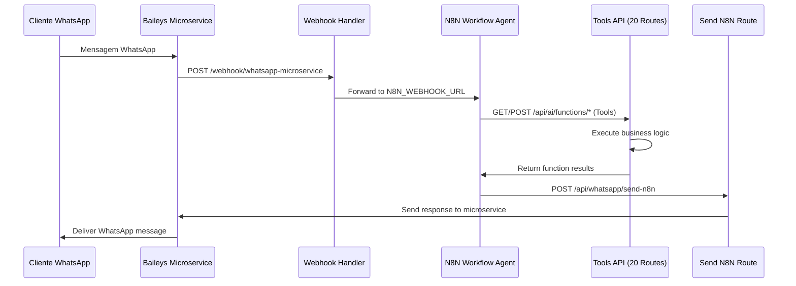

# LOCAI - Sistema Imobiliário com IA

Sistema especializado de gestão imobiliária para locação por temporada, construído com Next.js 15, Firebase e integração WhatsApp via microserviço Baileys + N8N workflows.

## 📋 Índice

1. [Visão Geral](#-visão-geral)
2. [Arquitetura N8N + Baileys](#-arquitetura-n8n--baileys)
3. [Sistema de Tools](#-sistema-de-tools)
4. [Integração WhatsApp + N8N](#-integração-whatsapp--n8n)
5. [API Endpoints](#-api-endpoints)
6. [Multi-tenant](#-multi-tenant)
7. [Estrutura do Projeto](#-estrutura-do-projeto)
8. [Configuração](#-configuração)

---

## 🎯 Visão Geral

LOCAI é uma plataforma técnica completa para gestão de imóveis de temporada, **abandonando o sistema de IA integrado** para focar em **tools expostas via API** que são consumidas por **workflows N8N externos**.

### Stack Tecnológico

```typescript
{
  "frontend": {
    "framework": "Next.js 15.3.5 (App Router)",
    "language": "TypeScript 5.3.0", 
    "ui": "Material-UI v5.15.0 + Emotion",
    "state": "React Context + Zustand",
    "forms": "React Hook Form + Yup",
    "charts": "Recharts v2.15.4"
  },
  "backend": {
    "runtime": "Node.js 20+",
    "database": "Firebase Firestore v10.7.0",
    "storage": "Firebase Storage", 
    "auth": "Firebase Auth + JWT",
    "tools": "20 API Routes expostas para N8N"
  },
  "automation": {
    "workflow": "N8N (External)",
    "ai": "OpenAI GPT-4o Mini (via N8N)",
    "whatsapp": "Baileys v6.7.18 (microservice DigitalOcean)",
    "integration": "REST API + Webhooks"
  },
  "payments": {
    "stripe": "v14.0.0",
    "cache": "LRU Cache + Redis opcional"
  }
}
```

### Funcionalidades Principais

- **🔧 Tools API**: 20 funções de negócio expostas via API Routes para N8N
- **🏢 Multi-tenant**: Isolamento completo de dados por organização
- **📱 WhatsApp + N8N**: Baileys microservice → N8N workflow → Tools → Response
- **📊 CRM Completo**: Pipeline de leads com scoring automático
- **🌐 Mini-sites**: Sites públicos com domínios customizados
- **📈 Dashboard Analítico**: Métricas e KPIs em tempo real

---

## 🏗️ Arquitetura N8N + Baileys

### Nova Arquitetura Híbrida (2025)

```
┌─────────────────────────────────────────────────────────┐
│                    Frontend (Next.js)                    │
│  ┌──────────┐  ┌──────────┐  ┌──────────┐  ┌────────┐ │
│  │Dashboard │  │Mini-site │  │   Auth   │  │ Tools  │ │
│  │   UI     │  │ Public   │  │Firebase  │  │  API   │ │
│  └──────────┘  └──────────┘  └──────────┘  └────────┘ │
└─────────────────────────────────────────────────────────┘
                            │
┌─────────────────────────────────────────────────────────┐
│                 N8N Automation Layer                    │
│  ┌──────────┐  ┌──────────┐  ┌──────────┐  ┌────────┐ │
│  │N8N Agent │  │AI Models │  │Workflows │  │ Logic  │ │  
│  │External  │  │GPT-4o    │  │ Engine   │  │Engine  │ │
│  └──────────┘  └──────────┘  └──────────┘  └────────┘ │
└─────────────────────────────────────────────────────────┘
                            │
┌─────────────────────────────────────────────────────────┐
│                Integration Layer                        │
│  ┌──────────┐  ┌──────────┐  ┌──────────┐  ┌────────┐ │
│  │Baileys   │  │Webhook   │  │Tools API │  │Business│ │
│  │Microserv.│  │Handlers  │  │20 Routes │  │Logic   │ │  
│  └──────────┘  └──────────┘  └──────────┘  └────────┘ │
└─────────────────────────────────────────────────────────┘
                            │
┌─────────────────────────────────────────────────────────┐
│                     Data Layer                          │
│  ┌──────────┐  ┌──────────┐  ┌──────────┐  ┌────────┐ │
│  │Firestore │  │ Storage  │  │Services  │  │Stripe  │ │
│  │Tenant DB │  │ Files    │  │ Cache    │  │ API    │ │
│  └──────────┘  └──────────┘  └──────────┘  └────────┘ │
└─────────────────────────────────────────────────────────┘
```

### Fluxo de Mensagens WhatsApp



### Padrões Arquiteturais

- **🔧 Tools Pattern**: Funções de negócio expostas via API Routes individuais
- **🤖 External Agent Pattern**: N8N gerencia IA e workflows externamente
- **📡 Microservice Pattern**: Baileys em serviço separado no DigitalOcean
- **🔗 Webhook Pattern**: Comunicação assíncrona via webhooks
- **🏭 Service Layer Pattern**: Separação de lógica de negócio
- **🏗️ Repository Pattern**: Abstração de acesso a dados
- **🏪 Factory Pattern**: Criação de services por tenant
- **👁️ Observer Pattern**: Subscriptions Firebase em tempo real
- **⚛️ Atomic Design**: Componentes organizados hierarquicamente

---

## 🔧 Sistema de Tools

### Arquitetura de Tools

O sistema **NÃO possui mais Sofia Agent integrado**. Em vez disso, expõe **20 funções de negócio** via **API Routes individuais** que são consumidas por **workflows N8N externos**.

```typescript
// Estrutura das Tools API
interface ToolsArchitecture {
  location: 'app/api/ai/functions/**/route.ts';
  count: 20;
  pattern: 'Individual API Routes';
  authentication: 'N8N_API_KEY';
  tenant_isolation: true;
  input_validation: 'Zod schemas';
  error_handling: 'Structured logging';
  caching: 'Property cache (5min TTL)';
  performance: 'Parallel execution support';
}
```

### Lista Completa de Tools (20)

#### 🔍 Busca e Descoberta
```typescript
// 1. POST /api/ai/functions/search-properties
interface SearchPropertiesArgs {
  location?: string;
  checkIn?: string;
  checkOut?: string;
  guests?: number;
  budget?: number;
  propertyType?: string;
}

// 2. GET /api/ai/functions/get-property-details/[propertyId]
interface GetPropertyDetailsArgs {
  propertyId: string;
  includeMedia?: boolean;
  includeAvailability?: boolean;
}

// 3. POST /api/ai/functions/send-property-media  
interface SendPropertyMediaArgs {
  propertyId: string;
  mediaType: 'photos' | 'videos' | 'all';
  clientPhone: string;
}

// 4. POST /api/ai/functions/check-availability
interface CheckAvailabilityArgs {
  propertyId: string;
  checkIn: string;
  checkOut: string;
  guests: number;
}
```

#### 💰 Preços e Financeiro
```typescript
// 5. POST /api/ai/functions/calculate-price
interface CalculatePriceArgs {
  propertyId: string;
  checkIn: string;
  checkOut: string;
  guests: number;
  discounts?: string[];
}

// 6. POST /api/ai/functions/generate-quote
interface GenerateQuoteArgs {
  propertyId: string;
  clientId: string;
  checkIn: string;
  checkOut: string;
  guests: number;
  specialRequests?: string;
}

// 7. POST /api/ai/functions/create-transaction
interface CreateTransactionArgs {
  clientId: string;
  reservationId?: string;
  amount: number;
  type: 'deposit' | 'full_payment' | 'fee';
  method: 'pix' | 'credit_card' | 'boleto';
}
```

#### 📅 Reservas e Agendamento
```typescript  
// 8. POST /api/ai/functions/create-reservation
interface CreateReservationArgs {
  propertyId: string;
  clientId: string;
  checkIn: string;
  checkOut: string;
  guests: number;
  totalPrice: number;
  paymentMethod: string;
}

// 9. PUT /api/ai/functions/cancel-reservation
interface CancelReservationArgs {
  reservationId: string;
  reason: string;
  refundAmount?: number;
}

// 10. PUT /api/ai/functions/modify-reservation
interface ModifyReservationArgs {
  reservationId: string;
  newCheckIn?: string;
  newCheckOut?: string;
  newGuests?: number;
  priceAdjustment?: number;
}
```

#### 👤 Clientes e CRM
```typescript
// 11. POST /api/ai/functions/register-client
interface RegisterClientArgs {
  name: string;
  phone: string;
  email?: string;
  document?: string;
  source: 'whatsapp' | 'website' | 'referral';
}

// 12. POST /api/ai/functions/create-lead
interface CreateLeadArgs {
  clientPhone: string;
  source: string;
  interests: string[];
  budget?: number;
  priority: 'hot' | 'warm' | 'cold';
}

// 13. PUT /api/ai/functions/update-lead
interface UpdateLeadArgs {
  leadId: string;
  status?: 'new' | 'contacted' | 'qualified' | 'proposal' | 'negotiation' | 'won' | 'lost';
  notes?: string;
  score?: number;
}

// 14. POST /api/ai/functions/classify-lead
interface ClassifyLeadArgs {
  leadId: string;
  conversationHistory: string[];
  clientBehavior: 'engaged' | 'interested' | 'undecided' | 'price_focused';
}

// 15. PUT /api/ai/functions/update-lead-status  
interface UpdateLeadStatusArgs {
  leadId: string;
  newStatus: 'new' | 'contacted' | 'qualified' | 'proposal' | 'won' | 'lost';
  reason?: string;
}
```

#### 🏠 Visitas e Políticas
```typescript
// 16. POST /api/ai/functions/schedule-visit
interface ScheduleVisitArgs {
  propertyId: string;
  clientId: string;
  preferredDate: string;
  preferredTime: string;
  visitType: 'presencial' | 'virtual';
}

// 17. GET /api/ai/functions/check-visit-availability
interface CheckVisitAvailabilityArgs {
  propertyId: string;
  date: string;
  timeSlots: string[];
}

// 18. GET /api/ai/functions/get-policies
interface GetPoliciesArgs {
  policyType: 'cancellation' | 'payment' | 'checkin' | 'pets' | 'smoking' | 'all';
  propertyId?: string;
}
```

#### 📊 Tarefas e Metas
```typescript
// 19. POST /api/ai/functions/create-task
interface CreateTaskArgs {
  title: string;
  description: string;
  assignedTo?: string;
  dueDate?: string;
  priority: 'low' | 'medium' | 'high';
  relatedEntity?: 'client' | 'property' | 'reservation';
}

// 20. POST /api/ai/functions/update-task
interface UpdateTaskArgs {
  taskId: string;
  status?: 'pending' | 'in_progress' | 'completed' | 'cancelled';
  notes?: string;
  completedAt?: string;
}
```

### Padrão de Implementação das Tools

```typescript
// Exemplo: /app/api/ai/functions/search-properties/route.ts
import { NextRequest, NextResponse } from 'next/server';
import { validateN8NAuth } from '@/lib/middleware/api-middleware';
import { searchProperties } from '@/lib/ai/tenant-aware-agent-functions';
import { logger } from '@/lib/utils/logger';
import { z } from 'zod';

const searchSchema = z.object({
  tenantId: z.string().min(1),
  location: z.string().optional(),
  checkIn: z.string().optional(),
  checkOut: z.string().optional(),
  guests: z.number().min(1).optional(),
  budget: z.number().min(0).optional()
});

export async function POST(request: NextRequest) {
  try {
    // 1. Autenticação N8N
    const authResult = await validateN8NAuth(request);
    if (!authResult.success) {
      return NextResponse.json(
        { success: false, error: 'Unauthorized' }, 
        { status: 401 }
      );
    }

    // 2. Validação de input
    const body = await request.json();
    const validation = searchSchema.safeParse(body);
    if (!validation.success) {
      return NextResponse.json({
        success: false,
        error: 'Validation failed',
        details: validation.error.flatten()
      }, { status: 400 });
    }

    // 3. Executar função de negócio
    const result = await searchProperties(validation.data, validation.data.tenantId);

    // 4. Log estruturado
    logger.info('🔍 [Tool] search-properties executed', {
      tenantId: validation.data.tenantId.substring(0, 8) + '***',
      resultCount: result.properties?.length || 0,
      success: result.success
    });

    return NextResponse.json(result);

  } catch (error) {
    logger.error('❌ [Tool] search-properties error:', error);
    return NextResponse.json({
      success: false,
      error: 'Internal tool error'
    }, { status: 500 });
  }
}
```

---

## 📱 Integração WhatsApp + N8N

### Arquitetura de Integração

```typescript
interface WhatsAppN8NArchitecture {
  microservice: {
    url: 'http://167.172.116.195:3000';
    technology: 'Baileys v6.7.18 (WhatsApp Web)';
    deployment: 'DigitalOcean Droplet';
    isolation: 'Multi-tenant sessions';
  };
  
  n8n_integration: {
    webhook_url: 'N8N_WEBHOOK_URL env var';
    authentication: 'N8N_WEBHOOK_SECRET';
    flow: 'Microservice → Frontend Webhook → N8N → Tools API';
  };
  
  tools_integration: {
    endpoint: '/api/ai/functions/**';
    count: 20;
    authentication: 'N8N_API_KEY';
    format: 'REST API calls from N8N workflows';
  };
}
```

### Fluxo Completo de Mensagem

#### 1. Recebimento da Mensagem
```typescript
// /app/api/webhook/whatsapp-microservice/route.ts
export async function POST(request: NextRequest) {
  // 1. Autenticação do microservice
  const isAuthenticated = await validateMicroserviceAuth(request);
  if (!isAuthenticated) return unauthorized();

  // 2. Parse do webhook
  const { event, tenantId, data } = await request.json();
  
  // 3. Processar evento de mensagem
  if (event === 'message') {
    await processIncomingMessageViaN8N(tenantId, data);
  }
  
  return NextResponse.json({ success: true });
}

async function processIncomingMessageViaN8N(tenantId: string, messageData: any) {
  // Deduplicação
  const messageId = messageData.messageId;
  if (deduplicationCache.isDuplicate(tenantId, messageId)) {
    return;
  }

  // Forward para N8N
  const n8nPayload = {
    tenantId,
    data: {
      from: messageData.from,
      message: messageData.message,
      messageId: messageId,
      timestamp: new Date().toISOString()
    },
    event: 'message',
    source: 'whatsapp-microservice'
  };

  await fetch(process.env.N8N_WEBHOOK_URL!, {
    method: 'POST',
    headers: {
      'Content-Type': 'application/json',
      'x-webhook-signature': process.env.N8N_WEBHOOK_SECRET!,
      'X-Tenant-ID': tenantId
    },
    body: JSON.stringify(n8nPayload)
  });
}
```

#### 2. Processamento N8N (Externo)
```typescript
// N8N Workflow (exemplo)
// 1. Receive webhook
// 2. Extract message and context  
// 3. Call OpenAI for intent detection
// 4. Based on intent, call appropriate tool:
//    - POST https://locai.app/api/ai/functions/search-properties
//    - POST https://locai.app/api/ai/functions/calculate-price
//    - etc.
// 5. Process multiple tools if needed
// 6. Generate final response
// 7. POST https://locai.app/api/whatsapp/send-n8n
```

#### 3. Envio de Resposta
```typescript
// /app/api/whatsapp/send-n8n/route.ts
export async function POST(request: NextRequest) {
  // 1. Autenticação N8N
  const authHeader = request.headers.get('Authorization');
  if (authHeader?.slice(7) !== process.env.N8N_API_KEY) {
    return NextResponse.json({ error: 'Unauthorized' }, { status: 401 });
  }

  // 2. Validar payload
  const { tenantId, clientPhone, finalMessage, mediaUrl } = await request.json();

  // 3. Criar cliente WhatsApp
  const whatsappClient = createWhatsAppClient(tenantId);

  // 4. Verificar conexão
  const status = await whatsappClient.getConnectionStatus();
  if (!status.connected) {
    return NextResponse.json({ 
      error: 'WhatsApp not connected' 
    }, { status: 400 });
  }

  // 5. Enviar mensagem
  if (mediaUrl) {
    await whatsappClient.sendImage(clientPhone, mediaUrl, finalMessage);
  } else {
    await whatsappClient.sendText(clientPhone, finalMessage);
  }

  return NextResponse.json({ 
    success: true, 
    messageId: `n8n_${Date.now()}` 
  });
}
```

### Configuração N8N

```bash
# Variáveis necessárias no N8N
N8N_WEBHOOK_URL=https://n8n-instance.com/webhook/whatsapp-locai
N8N_WEBHOOK_SECRET=shared-secret-with-frontend
N8N_API_KEY=api-key-to-call-tools
LOCAI_FRONTEND_URL=https://locai.app
OPENAI_API_KEY=your-openai-key
```

---

## 🔌 API Endpoints

### Estrutura Completa de APIs

#### Tools API (20 Endpoints)
```typescript
// AI Functions - Expostas para N8N
POST /api/ai/functions/search-properties
GET  /api/ai/functions/get-property-details/[id]
POST /api/ai/functions/send-property-media
POST /api/ai/functions/check-availability
POST /api/ai/functions/calculate-price
POST /api/ai/functions/generate-quote
POST /api/ai/functions/create-transaction
POST /api/ai/functions/create-reservation
PUT  /api/ai/functions/cancel-reservation
PUT  /api/ai/functions/modify-reservation
POST /api/ai/functions/register-client
POST /api/ai/functions/create-lead
PUT  /api/ai/functions/update-lead
POST /api/ai/functions/classify-lead
PUT  /api/ai/functions/update-lead-status
POST /api/ai/functions/schedule-visit
GET  /api/ai/functions/check-visit-availability
GET  /api/ai/functions/get-policies
POST /api/ai/functions/create-task
PUT  /api/ai/functions/update-task
```

#### WhatsApp Integration
```typescript
POST /api/webhook/whatsapp-microservice    # Receive from Baileys
POST /api/whatsapp/send-n8n               # Send via N8N
GET  /api/whatsapp/qr                     # QR code management
GET  /api/whatsapp/session/route          # Session status
POST /api/whatsapp/session/reset          # Reset session
```

#### Dashboard APIs
```typescript
// Properties
GET  /api/properties                      # List properties
POST /api/properties                      # Create property  
GET  /api/properties/[id]                 # Get property
PUT  /api/properties/[id]                 # Update property

// Clients
GET  /api/clients                         # List clients
POST /api/clients                         # Create client
GET  /api/clients/[id]                    # Get client

// Analytics
GET  /api/analytics                       # General analytics
GET  /api/metrics/advanced                # Advanced metrics
GET  /api/performance/stats               # Performance stats

// CRM
GET  /api/crm/analytics                   # CRM metrics
GET  /api/crm/leads/[id]/insights         # Lead insights

// Auth
POST /api/auth/logout                     # Logout
GET  /api/auth/me                         # Current user
PUT  /api/auth/profile                    # Update profile

// Mini-sites
GET  /api/mini-site/[tenantId]/config     # Site config
POST /api/mini-site/[tenantId]/inquiry    # Lead capture
GET  /api/mini-site/[tenantId]/properties # Public properties

// File Upload
POST /api/upload/avatar                   # Profile pictures
POST /api/upload/logo                     # Company logos
POST /api/upload/media                    # Property media

// Utility
GET  /api/health                          # Health check
GET  /api/admin/verify                    # Admin verification
```

### Autenticação por Tipo

```typescript
interface APIAuthentication {
  tools_api: {
    method: 'Bearer Token';
    header: 'Authorization: Bearer N8N_API_KEY';
    routes: '/api/ai/functions/**';
  };
  
  dashboard_api: {
    method: 'Firebase Auth JWT';
    header: 'Authorization: Bearer <firebase-token>';
    routes: '/api/{properties,clients,analytics}/**';
  };
  
  webhook_api: {
    method: 'HMAC Signature / API Key';
    header: 'X-Webhook-Signature / Authorization';
    routes: '/api/webhook/**';
  };
  
  public_api: {
    method: 'None / Optional';
    routes: '/api/mini-site/**/public-data';
  };
}
```

---

## 🏢 Multi-tenant

### Estrutura de Dados Multi-tenant

```typescript
// Firestore structure (unchanged)
interface FirestoreStructure {
  tenants: {
    [tenantId: string]: {
      properties: Property[];
      clients: Client[];
      reservations: Reservation[];
      conversations: Conversation[];
      messages: Message[];
      transactions: Transaction[];
      goals: FinancialGoal[];
      visits: Visit[];
      settings: TenantSettings[];
      // New collections
      leads: Lead[];
      tasks: Task[];
      automation_logs: AutomationLog[];
    };
  };
  
  users: {
    [userId: string]: {
      tenantId: string;
      role: 'admin' | 'user' | 'viewer';
      permissions: string[];
    };
  };
}
```

### TenantServiceFactory (Unchanged)

```typescript
// /lib/services/tenant-service-factory.ts
export class TenantServiceFactory {
  private services: Map<string, any> = new Map();
  
  constructor(private tenantId: string) {
    if (!tenantId) {
      throw new Error('Tenant ID is required');
    }
  }

  get properties() { return this.getService('properties', PropertyService); }
  get clients() { return this.getService('clients', ClientService); }
  get reservations() { return this.getService('reservations', ReservationService); }
  get conversations() { return this.getService('conversations', ConversationService); }
  // ... other services
}
```

### Tenant Isolation em Tools

```typescript
// Todas as tools seguem o mesmo padrão
export async function searchProperties(args: SearchArgs, tenantId: string) {
  // 1. Criar service factory para o tenant
  const serviceFactory = new TenantServiceFactory(tenantId);
  const propertyService = serviceFactory.properties;
  
  // 2. Executar operação com isolamento automático
  const properties = await propertyService.searchProperties({
    ...args,
    tenantId // Firestore query path: tenants/{tenantId}/properties
  });
  
  return {
    success: true,
    properties: properties.map(formatForResponse),
    tenantId // Return for logging/debugging
  };
}
```

---

## 📁 Estrutura do Projeto

### Organização de Diretórios

```
locai/
├── app/                        # Next.js 15 App Router
│   ├── api/                    # 70+ API Routes organizados
│   │   ├── ai/functions/       # 🔧 20 Tools API para N8N
│   │   │   ├── search-properties/route.ts
│   │   │   ├── calculate-price/route.ts
│   │   │   ├── create-reservation/route.ts
│   │   │   └── ... (17 mais)
│   │   ├── whatsapp/           # WhatsApp integration
│   │   │   ├── send-n8n/route.ts
│   │   │   ├── qr/route.ts
│   │   │   └── session/route.ts
│   │   ├── webhook/            # Webhook handlers
│   │   │   └── whatsapp-microservice/route.ts
│   │   ├── auth/               # Authentication
│   │   ├── clients/            # Client management
│   │   ├── properties/         # Property CRUD
│   │   ├── analytics/          # Dashboard metrics
│   │   └── mini-site/          # Public sites
│   ├── dashboard/              # Admin interface
│   │   ├── properties/         # Property management
│   │   ├── clients/            # Client management
│   │   ├── crm/                # Sales pipeline
│   │   ├── analytics/          # Reports
│   │   └── settings/           # Configuration
│   └── mini-site/[tenantId]/   # Public tenant sites
├── lib/                        # Business logic
│   ├── ai/                     # 🔧 Tools implementation
│   │   └── tenant-aware-agent-functions.ts  # 20 functions
│   ├── services/               # Business services (40+)
│   │   ├── property-service.ts
│   │   ├── client-service.ts
│   │   ├── tenant-service-factory.ts
│   │   └── ...
│   ├── whatsapp/              # WhatsApp clients
│   │   ├── whatsapp-client-factory.ts
│   │   └── microservice-auth-adapter.ts
│   ├── middleware/            # API middleware
│   │   ├── api-middleware.ts  # N8N auth validation
│   │   ├── auth.ts           # Firebase auth
│   │   └── rate-limit.ts     # Rate limiting
│   ├── types/                 # TypeScript definitions
│   └── utils/                 # Utilities
├── components/                # UI components (Atomic Design)
│   ├── atoms/                 # Basic components
│   ├── molecules/             # Composite components  
│   ├── organisms/             # Complex components
│   └── templates/             # Page layouts
└── contexts/                  # React state management

Microservice separado:
../whatsapp-microservice/      # Baileys service (DigitalOcean)
├── src/
│   ├── services/
│   │   ├── whatsapp.service.ts
│   │   ├── webhook.service.ts
│   │   └── tenant.service.ts
│   ├── routes/
│   └── middleware/
└── Dockerfile
```

### Principais Mudanças na Estrutura

#### Removidas (Sistema de IA Integrado)
```
❌ lib/ai-agent/sofia-agent.ts              # Agent principal removido
❌ lib/ai-agent/enhanced-intent-detector.ts # LangChain detector removido  
❌ lib/ai-agent/smart-summary-service.ts    # Summary service removido
❌ lib/ai-agent/conversation-context.ts     # Context manager removido
❌ lib/cache/property-cache-manager.ts      # Cache específico removido
❌ lib/services/sofia-analytics-service.ts  # Analytics Sofia removido
❌ app/api/agent/route.ts                   # Agent endpoint removido
```

#### Adicionadas (Sistema de Tools)
```
✅ app/api/ai/functions/*/route.ts          # 20 Tools API individuais
✅ app/api/whatsapp/send-n8n/route.ts       # N8N response sender
✅ lib/middleware/api-middleware.ts         # N8N auth middleware
✅ .env.n8n.example                         # N8N configuration template
```

#### Mantidas (Core Business)
```
✅ lib/ai/tenant-aware-agent-functions.ts   # Funções core (refatoradas)
✅ lib/services/tenant-service-factory.ts   # Multi-tenant services
✅ app/api/webhook/whatsapp-microservice/    # Webhook handler (updated)
✅ lib/whatsapp/whatsapp-client-factory.ts  # WhatsApp client
```

---

## ⚙️ Configuração

### Variáveis de Ambiente

```bash
# .env.local - Complete configuration

# Firebase (unchanged)
NEXT_PUBLIC_FIREBASE_API_KEY=
NEXT_PUBLIC_FIREBASE_AUTH_DOMAIN=
NEXT_PUBLIC_FIREBASE_PROJECT_ID=
NEXT_PUBLIC_FIREBASE_STORAGE_BUCKET=
NEXT_PUBLIC_FIREBASE_MESSAGING_SENDER_ID=
NEXT_PUBLIC_FIREBASE_APP_ID=
FIREBASE_SERVICE_ACCOUNT_KEY=

# N8N Integration (NEW)
N8N_WEBHOOK_URL=https://your-n8n-instance.com/webhook/whatsapp-messages
N8N_WEBHOOK_SECRET=your-n8n-webhook-secret
N8N_API_KEY=your-n8n-api-key

# WhatsApp - APENAS Baileys Microservice
WHATSAPP_MICROSERVICE_URL=http://167.172.116.195:3000
WHATSAPP_MICROSERVICE_API_KEY=your-microservice-api-key
WHATSAPP_WEBHOOK_SECRET=your-webhook-secret
WHATSAPP_WEBHOOK_VERIFY_TOKEN=locai-webhook-verify

# Application
NEXT_PUBLIC_APP_URL=http://localhost:8080
TENANT_ID=default-tenant
NODE_ENV=development

# OpenAI (for N8N usage - optional)
# OPENAI_API_KEY=  # Only needed if N8N calls OpenAI

# Optional: Stripe  
STRIPE_SECRET_KEY=
STRIPE_WEBHOOK_SECRET=
```

### N8N Workflow Configuration

```bash
# Variáveis necessárias no N8N workflow
LOCAI_FRONTEND_URL=https://your-locai-instance.com
LOCAI_API_KEY=${N8N_API_KEY}  # Same as N8N_API_KEY in frontend
OPENAI_API_KEY=your-openai-key-for-ai-processing
WEBHOOK_SECRET=shared-secret-with-frontend
```

### Scripts de Desenvolvimento

```bash
# Instalação e desenvolvimento  
npm install                   # Install dependencies
npm run dev                   # Dev server (port 8080)

# Build e produção
npm run build                 # Production build
npm run start                 # Production server
npm run type-check            # TypeScript validation
npm run lint                  # ESLint check
npm run lint:fix              # Auto-fix linting

# Testes e validação
npm run prod-check            # Pre-deployment check
npm run health                # Health check
npm run clean                 # Clean cache

# Deploy
npm run deploy                # Deploy to production

# Specific tools testing (via curl/Postman)
curl -X POST http://localhost:8080/api/ai/functions/search-properties \
  -H "Authorization: Bearer ${N8N_API_KEY}" \
  -H "Content-Type: application/json" \
  -d '{"tenantId":"test","location":"Praia"}'
```

### Deployment Architecture

```typescript
interface DeploymentConfig {
  frontend: {
    platform: 'Netlify | Vercel | DigitalOcean';
    requirements: {
      node: '>=20.0.0';
      memory: '512MB minimum';
      build_time: '5-10 minutes';
    };
  };
  
  whatsapp_microservice: {
    platform: 'DigitalOcean Droplet';
    url: 'http://167.172.116.195:3000';
    requirements: {
      memory: '1GB minimum';
      storage: '10GB for sessions';
      uptime: '99.9% required';
    };
  };
  
  n8n_workflows: {
    platform: 'N8N Cloud | Self-hosted';
    requirements: {
      memory: '2GB minimum';
      concurrent_executions: '10+ simultaneous';
      ai_model_access: 'OpenAI API required';
    };
  };
  
  integrations: {
    firebase: 'Firestore + Storage + Auth';
    stripe: 'Payment processing (optional)';
    monitoring: 'Structured logging + error tracking';
  };
}
```

---

## 🎯 Performance e Monitoramento

### Performance Optimizations

- **⚡ Tools Response Time**: <500ms per tool execution
- **📦 Bundle Size**: ~2.5MB (otimizado com tree shaking) 
- **🏎️ Load Time**: <3s em 3G, <1s em banda larga
- **💾 Database**: Índices otimizados no Firestore por tenant
- **🔄 Cache**: Property cache (5min TTL) nas tools críticas
- **📡 N8N Integration**: Webhook timeout 30s, retry logic

### Segurança

- **🔐 Authentication**: 
  - Dashboard: Firebase Auth com JWT
  - Tools API: N8N API Key via Bearer token
  - Webhooks: HMAC signatures + API keys
- **🛡️ Authorization**: Role-based access control per tenant
- **✅ Input Validation**: Zod schemas em todas as tools
- **⚡ Rate Limiting**: 20 mensagens/minuto para WhatsApp
- **🏠 Tenant Isolation**: Separação completa de dados
- **🧹 XSS Protection**: Sanitização automática

### Monitoramento

- **📊 Logging**: Estruturado com Pino logger
- **🚨 Error Tracking**: Captura automática em todas as tools
- **📈 Metrics**: 
  - Tools execution time e success rate
  - N8N workflow performance
  - WhatsApp message delivery rate
  - Database query performance
- **🩺 Health Checks**: 
  - `/api/health` - Frontend health
  - Microservice health endpoint
  - N8N workflow monitoring
- **👁️ Observability**: Real-time dashboard metrics

---

## 🚀 Migration Notes (Para Desenvolvedores)

### Do Sistema Sofia para Tools API

#### Antes (Sistema Integrado)
```typescript
// ❌ Sistema antigo - Agent interno
const response = await sofiaAgent.processMessage({
  message: "quero um apartamento",
  clientPhone: "123456789",
  tenantId: "tenant123"
});
// Sofia processava tudo internamente
```

#### Depois (N8N + Tools)
```typescript
// ✅ Sistema atual - Tools externas
// 1. N8N recebe a mensagem
// 2. N8N chama: POST /api/ai/functions/search-properties
// 3. N8N chama: POST /api/ai/functions/send-property-media  
// 4. N8N gera resposta final
// 5. N8N chama: POST /api/whatsapp/send-n8n
```

#### Benefícios da Migração
- **🔧 Flexibilidade**: Tools podem ser chamadas por qualquer sistema
- **🎯 Especialização**: N8N especializado em workflows
- **📈 Escalabilidade**: Cada componente escala independentemente
- **🔍 Debugging**: Logs separados por tool facilitam debug
- **🔄 Manutenção**: Easier to update individual tools
- **🧪 Testing**: Individual tools podem ser testadas isoladamente

---

*Sistema LOCAI - Versão 4.0*  
*Arquitetura: N8N + Baileys + Tools API*  
*Última atualização: Janeiro 2025*  
*Status: Production Ready*