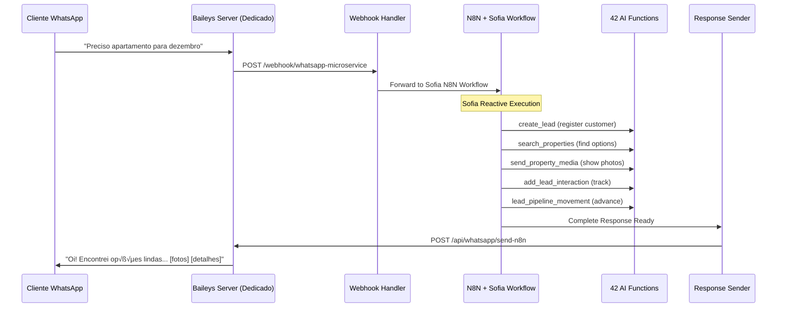

# LOCAI - Sistema Imobiliário com IA 🏠🤖

Sistema especializado de gestão imobiliária para locação por temporada, construído com Next.js 15, Firebase e integração Sofia AI via N8N workflows + Baileys microservice.

## 📋 Índice

1. [Vis√£o Geral](#-vis√£o-geral)
2. [Arquitetura Moderna N8N + Sofia](#-arquitetura-moderna-n8n--sofia)
3. [Sistema de 42 AI Functions](#-sistema-de-42-ai-functions)
4. [CRM Avançado com Analytics](#-crm-avançado-com-analytics)
5. [Integração WhatsApp + Sofia](#-integração-whatsapp--sofia)
6. [API Endpoints](#-api-endpoints)
7. [Multi-tenant](#-multi-tenant)
8. [Estrutura do Projeto](#-estrutura-do-projeto)
9. [Configuração](#-configuração)

---

## 🎯 Visão Geral

LOCAI é uma plataforma **enterprise-grade** completa para gestão de imóveis de temporada, com **Sofia AI Agent** especializada em consultoria imobiliária, integrada via **N8N workflows** e **servidor Baileys dedicado** para WhatsApp.

### üöÄ Arquitetura Moderna (Setembro 2025)

```typescript
{
  "core": {
    "framework": "Next.js 15.3.5 (App Router)",
    "language": "TypeScript 5.3.0",
    "ui": "Material-UI v5.15.0 + Emotion",
    "state": "React Context + Zustand",
    "database": "Firebase Firestore v10.7.0",
    "auth": "Firebase Auth + JWT Multi-tenant"
  },
  "ai_architecture": {
    "agent": "Sofia - Consultora Imobili√°ria Especializada",
    "workflow_engine": "N8N v1.0+ (External)",
    "ai_model": "OpenAI GPT-4o Mini (via N8N)",
    "functions": "42 Business Functions via API",
    "behavior": "Reactive - Single Complete Response"
  },
  "messaging": {
    "whatsapp": "Baileys v6.7.18 (Dedicated Server)",
    "deployment": "DigitalOcean Dedicated Droplet",
    "integration": "REST API + N8N Webhooks",
    "session": "Multi-tenant QR Code Authentication"
  },
  "crm_system": {
    "pipeline": "Automatic Lead Progression",
    "scoring": "Dynamic 20+ Factors AI Scoring",
    "analytics": "Advanced Conversion Funnels",
    "visualization": "Recharts Interactive Charts"
  }
}
```

### ‚ú® Funcionalidades Principais

- **🤖 Sofia AI Agent**: Consultora especializada com comportamento reativo
- **🎛️ CRM Avançado**: Pipeline automatizado com 5 dashboards analíticos
- **🔧 42 AI Functions**: Endpoints especializados para automação completa de negócios
- **🏢 Multi-tenant**: Isolamento completo por organização (`tenants/{tenantId}/collections`)
- **üì± WhatsApp Dedicado**: Servidor Baileys separado para performance otimizada
- **🌐 Mini-sites**: Sites públicos com domínios customizados e captura de leads
- **📊 Analytics Avançado**: Funis de conversão e business intelligence
- **🛡️ Enterprise Security**: Validação Zod, sanitização de inputs, rate limiting

---

## 🏗️ Arquitetura Moderna N8N + Sofia

### Arquitetura de 4 Camadas (2025)

```
┌─────────────────────────────────────────────────────────┐
│                Frontend Layer (Next.js)                 │
│  ┌────────────┐ ┌────────────┐ ┌────────────┐ ┌──────┐ │
│  │Advanced CRM│ │Mini-sites  │ │   Auth     │ │Admin │ │
│  │5 Dashboards│ │Custom DNS  │ │Multi-tenant│ │Panel │ │
│  │Analytics   │ │Lead Capture│ │Firebase    │ │Ultra │ │
│  └────────────┘ └────────────┘ └────────────┘ └──────┘ │
└─────────────────────────────────────────────────────────┘
                            │ REST APIs
┌─────────────────────────────────────────────────────────┐
│              Sofia AI + N8N Layer                       │
│  ┌────────────┐ ┌────────────┐ ┌────────────┐ ┌──────┐ │
│  │Sofia Agent │ │N8N Workflow│ │42 Functions│ │  AI  │ │
│  │Specialized │ │Engine      │ │Business    │ │GPT4o │ │
│  │Real Estate │ │External    │ │Automation  │ │ Mini │ │
│  │Consultant  │ │Processing  │ │            │ │      │ │
│  └────────────┘ └────────────┘ └────────────┘ └──────┘ │
└─────────────────────────────────────────────────────────┘
                            │ Webhooks
┌─────────────────────────────────────────────────────────┐
│             Integration Layer                           │
│  ┌────────────┐ ┌────────────┐ ┌────────────┐ ┌──────┐ │
│  │Baileys     │ │Webhook     │ │42 AI Func  │ │CRM   │ │
│  │Dedicated   │ │Handlers    │ │API Routes  │ │Auto  │ │
│  │Server      │ │N8N Bridge  │ │Business    │ │Pipe  │ │
│  │DigitalOcean│ │            │ │Logic       │ │line  │ │
│  └────────────┘ └────────────┘ └────────────┘ └──────┘ │
└─────────────────────────────────────────────────────────┘
                            │ Data Services
┌─────────────────────────────────────────────────────────┐
│                Data Layer                               │
│  ┌────────────┐ ┌────────────┐ ┌────────────┐ ┌──────┐ │
│  │Firestore   │ │Storage     │ │Services    │ │Cache │ │
│  │Multi-tenant│ │Media Files │ │Factory     │ │LRU   │ │
│  │Isolation   │ │Compressed  │ │Tenant      │ │5min  │ │
│  │Complete    │ │Thumbnails  │ │Scoped      │ │TTL   │ │
│  └────────────┘ └────────────┘ └────────────┘ └──────┘ │
└─────────────────────────────────────────────────────────┘
```

### 🤖 Sofia AI Agent - Especialista Imobiliária

**Características da Sofia**:
- **Comportamento Reativo**: Nunca envia "Aguarde..." ou "Estou verificando..."
- **Resposta Completa**: Executa todas as funções e responde tudo de uma vez
- **Pipeline Automático**: Move leads automaticamente através dos estágios CRM
- **Especialista**: 8+ anos de experiência em locações por temporada (persona)
- **Consultiva**: Abordagem focada em relacionamento, n√£o apenas vendas

### üì± Fluxo Sofia WhatsApp (Atualizado)



**Vantagens do Fluxo Sofia**:
- **‚ö° Resposta √önica**: Cliente recebe tudo de uma vez
- **🎯 Especializada**: Conhece cada imóvel do portfólio
- **🔄 CRM Automático**: Pipeline progride automaticamente
- **📊 Analytics**: Toda interação é rastreada
- **💡 Inteligente**: Oferece alternativas quando algo não está disponível

---

## üîß Sistema de 42 AI Functions

### Nova Arquitetura de Functions (2025)

O sistema possui **42 funções especializadas** via **API Routes individuais** consumidas pela **Sofia via N8N**.

```typescript
// Arquitetura de AI Functions
interface SofiaFunctionsArchitecture {
  agent: 'Sofia - Consultora Imobili√°ria Especializada';
  location: 'app/api/ai/functions/**/route.ts';
  count: 42; // Verified via system audit
  pattern: 'Individual Specialized Endpoints';
  authentication: 'N8N_API_KEY Bearer Token';
  tenant_isolation: true; // tenants/{tenantId}/collections
  reactive_execution: true;
  pipeline_automation: true;
  validation: 'Zod schemas on all endpoints';
  security: 'Input sanitization + rate limiting';
}
```

### 🏠 Property Management Functions
```typescript
// Busca e Descoberta
POST /api/ai/functions/search-properties          // Busca avançada
GET  /api/ai/functions/get-property-details      // Info completa
POST /api/ai/functions/send-property-media       // Fotos/videos
POST /api/ai/functions/send-property-map         // Localização
POST /api/ai/functions/check-availability        // Disponibilidade

// Exemplo de uso Sofia:
// Cliente: "Quero apartamento para 4 pessoas em dezembro"
// Sofia executa: search_properties ‚Üí send_property_media ‚Üí (resposta completa)
```

### üí∞ Financial Operations Functions
```typescript
// Preços e Transações
POST /api/ai/functions/calculate-price           // C√°lculo din√¢mico
POST /api/ai/functions/generate-quote            // Orçamento formal
POST /api/ai/functions/create-transaction        // Pagamentos
POST /api/ai/functions/track-metrics            // Métricas

// Exemplo de uso Sofia:
// Cliente: "Quanto custa o Vista Mar para 5 dias?"
// Sofia executa: check_availability → calculate_price → (orçamento detalhado)
```

### üìÖ Booking Management Functions
```typescript
// Reservas e Modificações
POST /api/ai/functions/create-reservation        // Criar reserva
POST /api/ai/functions/cancel-reservation        // Cancelar
POST /api/ai/functions/modify-reservation        // Modificar
POST /api/ai/functions/schedule-visit           // Agendar visita
GET  /api/ai/functions/check-visit-availability  // Disponibilidade visita

// Exemplo de uso Sofia:
// Cliente: "Pode reservar o Vista Mar?"
// Sofia executa: register_client ‚Üí create_reservation ‚Üí schedule_meeting
```

### 👤 CRM Integration Functions (6 NOVAS)
```typescript
// Sistema CRM Completo
POST /api/ai/functions/create-lead              // Criação inteligente
GET  /api/ai/functions/get-lead-details         // Info completa lead
GET  /api/ai/functions/get-leads-list           // Lista filtrada
POST /api/ai/functions/add-lead-interaction     // Rastrear interação
POST /api/ai/functions/analyze-lead-performance // An√°lise AI
POST /api/ai/functions/follow-up-lead           // Follow-up autom√°tico
POST /api/ai/functions/lead-pipeline-movement   // Progress√£o pipeline

// Exemplo autom√°tico Sofia:
// Toda conversa dispara: create_lead ‚Üí add_lead_interaction ‚Üí lead_pipeline_movement
```

### üìã Policies & Information Functions
```typescript
// Informações e Políticas
GET  /api/ai/functions/get-policies             // Políticas negócio
POST /api/ai/functions/register-client          // Registro cliente
POST /api/ai/functions/schedule-meeting         // Agendamentos
GET  /api/ai/functions/check-agenda-availability // Calend√°rio
POST /api/ai/functions/classify-lead            // Classificação
POST /api/ai/functions/update-lead              // Atualização
```

### 🎯 Goals & Analytics Functions
```typescript
// Metas e Performance
POST /api/ai/functions/create-goal              // Criação metas
POST /api/ai/functions/update-goal-progress     // Progresso
POST /api/ai/functions/analyze-performance      // An√°lise completa
```

### ‚ö° create_lead Simplificado (DESTAQUE)

**JSON Mínimo**:
```json
{
  "tenantId": "tenant123",
  "phone": "+5511999999999"
}
```

**Funcionalidades**:
- ✅ **Deduplicação Automática**: Merge com lead existente se mesmo telefone
- ✅ **Score Inteligente**: Só aumenta, nunca diminui por engano
- ✅ **Temperature Progressive**: cold → warm → hot (só evolui)
- ✅ **Histórico Preservado**: Todas as mensagens são mantidas
- ✅ **CRM Integrado**: Criação/atualização trackeia interação automaticamente

### 🛡️ Validação Enterprise (Exemplo Real)

**Reservations API com Zod** (`app/api/reservations/[id]/route.ts`):

```typescript
// Validação completa com Zod
const UpdateReservationSchema = z.object({
  propertyId: z.string()
    .min(1, 'ID da propriedade é obrigatório')
    .max(100, 'ID da propriedade inv√°lido')
    .optional(),

  checkIn: z.coerce.date({
    errorMap: () => ({ message: 'Data de check-in inv√°lida' })
  }).optional(),

  guests: z.number()
    .int('Número de hóspedes deve ser inteiro')
    .positive('Número de hóspedes deve ser positivo')
    .min(1, 'Deve ter pelo menos 1 hóspede')
    .optional(),

  totalAmount: z.number()
    .min(0, 'Valor total n√£o pode ser negativo')
    .optional(),

  status: z.nativeEnum(ReservationStatus).optional(),

  paymentStatus: z.nativeEnum(PaymentStatus).optional(),

  specialRequests: z.string()
    .max(2000, 'Solicitações especiais devem ter no máximo 2000 caracteres')
    .optional(),
});

// Validação + Sanitização + Business Rules
const validationResult = UpdateReservationSchema.safeParse(body);
if (!validationResult.success) {
  return NextResponse.json({
    error: 'Dados inv√°lidos',
    code: 'VALIDATION_ERROR',
    details: validationResult.error.flatten()
  }, { status: 400 });
}

// Sanitize text inputs
sanitizedData.specialRequests = sanitizeUserInput(validatedData.specialRequests);

// Business rule validation
if (checkOut <= checkIn) {
  return NextResponse.json({
    error: 'Data de check-out deve ser posterior à data de check-in',
    code: 'VALIDATION_ERROR'
  }, { status: 400 });
}
```

**Padr√£o usado em todas as 42 AI Functions**

---

## 🎛️ CRM Avançado com Analytics

### 5 Dashboards Analíticos (NOVO)

**1. Pipeline**: Kanban drag-and-drop com stages autom√°ticos
**2. Todos os Leads**: Lista completa com filtros avançados
**3. Insights IA**: Recomendações e predições AI-powered
**4. **Analytics Avançado**: Business intelligence completo
**5. **Performance**: Rastreamento tempo real por lead

### üìä Advanced Analytics Dashboard

```typescript
// Componentes de Visualização
interface CRMAnalytics {
  components: {
    'AdvancedAnalytics.tsx': 'Funis convers√£o + time series';
    'LeadPerformanceTracker.tsx': 'Rastreamento individual';
    'AIInsights.tsx': 'Recomendações AI';
    'CRMStats.tsx': 'KPIs principais';
  };

  features: {
    conversion_funnel: 'Pipeline visual com taxas por est√°gio';
    time_series: 'Evolução leads e conversões temporais';
    source_performance: 'ROI por fonte de lead';
    individual_tracking: 'Score e risco por lead';
    interactive_charts: 'Recharts responsivo';
  };
}
```

### 🔄 Pipeline Automation (NOVA LÓGICA)

**Sofia move leads automaticamente**:
```typescript
// Progress√£o Autom√°tica
new ‚Üí contacted      // Sofia primeira resposta
contacted → qualified    // Identifica necessidades (data/orçamento)
qualified → presentation // Mostra opções de imóveis
presentation → proposal  // Cliente pede orçamento
proposal → negotiation   // Discussão de preço
negotiation → closing    // Confirmação orçamento
closing → won           // Reserva concluída
```

**Dynamic Lead Scoring**:
- **Base Score**: Qualidade inicial do lead
- **Temperature Bonus**: hot (+15), warm (+5), cold (-10)
- **Interaction Bonus**: Frequência e engajamento
- **Time Decay**: Redução para leads antigos
- **AI Enhanced**: Ajustes baseados em ML

---

## 📱 Integração WhatsApp + Sofia

### Servidor Baileys Dedicado

```typescript
interface BaileysArchitecture {
  server: {
    url: 'http://167.172.116.195:3000';
    technology: 'Baileys v6.7.18 (WhatsApp Web)';
    deployment: 'DigitalOcean Dedicated Droplet';
    isolation: 'Multi-tenant QR sessions';
    performance: 'Dedicated resources for WhatsApp';
  };

  features: {
    session_management: 'QR code por tenant';
    media_handling: 'Upload/download direto';
    multi_device: 'WhatsApp multi-device support';
    auto_reconnection: 'Reconex√£o autom√°tica';
    message_queue: 'Fila de mensagens confi√°vel';
  };
}
```

### 🔄 Sofia Message Flow (Detalhado)

#### 1. Recebimento (Baileys ‚Üí Frontend)
```typescript
// /app/api/webhook/whatsapp-microservice/route.ts
export async function POST(request: NextRequest) {
  const { event, tenantId, data } = await request.json();

  if (event === 'message') {
    // Forward para Sofia via N8N
    await fetch(process.env.N8N_WEBHOOK_URL!, {
      method: 'POST',
      body: JSON.stringify({
        tenantId,
        message: data.message,
        phone: data.from,
        source: 'whatsapp-baileys'
      })
    });
  }
}
```

#### 2. Processamento Sofia (N8N Workflow)
```typescript
// N8N Workflow - Sofia Reactive Execution
// 1. Receive message
// 2. Determine customer status (new/existing)
// 3. Execute reactive function sequence:
//    - create_lead (if first contact)
//    - search_properties (if asking for options)
//    - send_property_media (show photos immediately)
//    - add_lead_interaction (track conversation)
//    - lead_pipeline_movement (advance stage)
// 4. Generate complete response
// 5. Send via: POST /api/whatsapp/send-n8n
```

#### 3. Envio Resposta (Frontend ‚Üí Baileys)
```typescript
// /app/api/whatsapp/send-n8n/route.ts
export async function POST(request: NextRequest) {
  const { tenantId, clientPhone, finalMessage, mediaUrl } = await request.json();

  const whatsappClient = createWhatsAppClient(tenantId);

  if (mediaUrl) {
    await whatsappClient.sendImage(clientPhone, mediaUrl, finalMessage);
  } else {
    await whatsappClient.sendText(clientPhone, finalMessage);
  }

  return NextResponse.json({ success: true });
}
```

### Sofia Reactive Behavior (DIFERENCIAL)

**‚ùå Comportamento Tradicional**:
```
Cliente: "Quero apartamento"
Bot: "Aguarde, estou buscando opções..."
Bot: "Encontrei 3 opções, quer ver?"
Cliente: "Sim"
Bot: "Enviando fotos..."
```

**‚úÖ Comportamento Sofia Reativo**:
```
Cliente: "Quero apartamento"
Sofia: "Oi! Que ótimo! 😊 Encontrei opções lindas para você:

🏠 **Vista Mar Premium**
👥 Até 6 pessoas • 🛏️ 3 quartos
üí∞ A partir de R$ 420/noite
‚ú® Vista panor√¢mica exclusiva

[FOTO DO APARTAMENTO]

Esse é um dos mais procurados! Quer ver mais detalhes ou outras opções?"
```

**Vantagens do Reativo**:
- ‚ö° **Resposta √önica**: Todo processamento em background
- 🎯 **Completa**: Texto + foto + informações em uma mensagem
- 🔄 **CRM Automático**: Pipeline já avançou para "presentation"
- 💡 **Proativa**: Já oferece próximos passos

---

## üåê API Endpoints

### Estrutura de APIs (Atualizada)

#### 42 AI Functions (Sofia Integration) - Complete List

```typescript
// === PROPERTY MANAGEMENT (10 functions) ===
POST /api/ai/functions/search-properties           // Advanced search with filters
GET  /api/ai/functions/get-property-details       // Complete property info
POST /api/ai/functions/send-property-media        // Photo/video delivery
POST /api/ai/functions/send-property-map          // Location information
POST /api/ai/functions/check-availability         // Real-time availability
POST /api/ai/functions/get-property-amenities     // Amenities listing
POST /api/ai/functions/compare-properties         // Side-by-side comparison
POST /api/ai/functions/get-similar-properties     // Alternative suggestions
POST /api/ai/functions/update-property-status     // Status management
POST /api/ai/functions/import-properties          // Bulk import

// === FINANCIAL OPERATIONS (8 functions) ===
POST /api/ai/functions/calculate-price            // Dynamic pricing engine
POST /api/ai/functions/generate-quote             // Formal quotations
POST /api/ai/functions/create-transaction         // Payment processing
POST /api/ai/functions/track-metrics              // Financial tracking
POST /api/ai/functions/process-payment            // Payment execution
POST /api/ai/functions/generate-invoice           // Invoice generation
POST /api/ai/functions/get-financial-summary      // Financial reports
POST /api/ai/functions/track-commission           // Commission tracking

// === BOOKING MANAGEMENT (7 functions) ===
POST /api/ai/functions/create-reservation         // Complete booking creation
POST /api/ai/functions/cancel-reservation         // Cancellation with refund
POST /api/ai/functions/modify-reservation         // Booking modifications
POST /api/ai/functions/schedule-visit             // Property visit scheduling
GET  /api/ai/functions/check-visit-availability   // Visit slot verification
POST /api/ai/functions/confirm-booking            // Booking confirmation
POST /api/ai/functions/get-booking-history        // Historical bookings

// === CRM INTEGRATION (9 functions) ===
POST /api/ai/functions/create-lead                // Smart lead creation
GET  /api/ai/functions/get-lead-details           // Lead information
GET  /api/ai/functions/get-leads-list             // Filtered lead listing
POST /api/ai/functions/add-lead-interaction       // Interaction tracking
POST /api/ai/functions/analyze-lead-performance   // AI-powered analysis
POST /api/ai/functions/follow-up-lead             // Follow-up automation
POST /api/ai/functions/lead-pipeline-movement     // Pipeline progression
POST /api/ai/functions/classify-lead              // Lead classification
POST /api/ai/functions/update-lead-status         // Status management

// === CLIENT MANAGEMENT (4 functions) ===
POST /api/ai/functions/register-client            // Client registration
GET  /api/ai/functions/get-client-details         // Client information
POST /api/ai/functions/update-client              // Client updates
POST /api/ai/functions/merge-duplicate-clients    // Deduplication

// === POLICIES & INFORMATION (4 functions) ===
GET  /api/ai/functions/get-policies               // Business policies
POST /api/ai/functions/schedule-meeting           // Meeting scheduling
GET  /api/ai/functions/check-agenda-availability  // Calendar checking
GET  /api/ai/functions/get-tenant-settings        // Tenant configuration
```

**Total: 42 Specialized AI Function Endpoints**

#### WhatsApp Integration (Updated)
```typescript
POST /api/webhook/whatsapp-microservice    # Receive from Baileys
POST /api/whatsapp/send-n8n               # Send via Sofia/N8N
GET  /api/whatsapp/qr                     # QR code management
GET  /api/whatsapp/session                # Session status
POST /api/whatsapp/session/reset          # Reset session
```

#### CRM Dashboard APIs (NEW)
```typescript
GET  /api/crm/analytics                   # CRM metrics
GET  /api/crm/leads/[id]/insights         # Lead insights
POST /api/crm/leads                       # Create lead via dashboard
PUT  /api/crm/leads/[id]                  # Update lead
```

#### Core Application APIs
```typescript
// Properties
GET  /api/properties                      # List properties
POST /api/properties                      # Create property
PUT  /api/properties/[id]                 # Update property
POST /api/properties/import               # Bulk import

// Analytics (Advanced)
GET  /api/metrics/advanced                # Business intelligence
GET  /api/performance/stats               # Performance metrics

// Auth & Admin
POST /api/auth/logout                     # Logout
GET  /api/auth/me                         # Current user
GET  /api/admin/all-tickets               # Admin panel
GET  /api/admin/stats                     # System stats

// Mini-sites
GET  /api/mini-site/domain                # Domain management
GET  /api/mini-site/analytics             # Site analytics
```

### Authentication Matrix (Updated)

```typescript
interface AuthenticationMatrix {
  sofia_ai_functions: {
    method: 'Bearer Token (N8N_API_KEY)';
    header: 'Authorization: Bearer <N8N_API_KEY>';
    routes: '/api/ai/functions/**';
    usage: 'Sofia via N8N workflows';
  };

  dashboard_apis: {
    method: 'Firebase Auth JWT';
    header: 'Authorization: Bearer <firebase-token>';
    routes: '/api/{properties,crm,analytics}/**';
    usage: 'Dashboard interface';
  };

  webhook_handlers: {
    method: 'HMAC Signature + API Key';
    header: 'X-Webhook-Signature';
    routes: '/api/webhook/**';
    usage: 'Baileys microservice integration';
  };

  admin_panel: {
    method: 'Firebase JWT + idog: true';
    route: '/dashboard/lkjhg';
    usage: 'Ultra-secure admin interface';
  };
}
```

---

## 🏢 Multi-tenant

### Estrutura Multi-tenant (Mantida)

```typescript
// Firestore Structure - Unchanged
interface FirestoreMultiTenant {
  tenants: {
    [tenantId: string]: {
      // Core Collections
      properties: Property[];
      clients: Client[];
      reservations: Reservation[];

      // CRM Collections (NEW)
      leads: Lead[];
      tasks: Task[];
      lead_interactions: Interaction[];

      // Communication
      conversations: Conversation[];
      messages: Message[];

      // Business
      transactions: Transaction[];
      goals: FinancialGoal[];
      visits: Visit[];
      settings: TenantSettings[];
    };
  };

  users: {
    [userId: string]: {
      tenantId: string;
      role: 'admin' | 'user' | 'viewer';
      permissions: string[];
    };
  };
}
```

### TenantServiceFactory (Implementação Real)

**Estrutura da Classe** (`lib/firebase/firestore-v2.ts`):

```typescript
export class MultiTenantFirestoreService<T extends { id?: string }> {
  private tenantId: string;
  private collectionName: string;

  constructor(tenantId: string, collectionName: string) {
    this.tenantId = tenantId;
    this.collectionName = collectionName;
  }

  // Collection path: tenants/{tenantId}/{collectionName}
  protected getCollectionRef(): CollectionReference {
    return collection(db, 'tenants', this.tenantId, this.collectionName);
  }

  // CRUD Operations with automatic tenant isolation
  async create(data: Omit<T, 'id'>): Promise<string> {
    const docData = {
      ...data,
      createdAt: Timestamp.now(),
      updatedAt: Timestamp.now(),
      tenantId: this.tenantId, // Always include for security
    };
    const docRef = await addDoc(this.getCollectionRef(), docData);
    return docRef.id;
  }

  async get(id: string): Promise<T | null> {
    const docSnap = await getDoc(this.getDocRef(id));
    if (docSnap.exists()) {
      return { id: docSnap.id, ...docSnap.data() } as T;
    }
    return null;
  }

  // Optimized queries with caching
  async getManyOptimized(
    filters: QueryFilter[],
    options?: { orderBy?: any; limit?: number }
  ): Promise<T[]> {
    const optimizedQuery = queryOptimizer.optimizeQuery(filters, options);

    logger.info('Executing optimized query', {
      tenantId: this.tenantId,
      collection: this.collectionName,
      filterCount: optimizedQuery.filters.length,
      estimatedCost: optimizedQuery.estimatedCost
    });

    // Build and execute query...
    return results;
  }

  // Real-time subscriptions
  onSnapshot(callback: (data: T[]) => void, constraints?: any[]): () => void {
    const q = constraints?.length
      ? query(this.getCollectionRef(), ...constraints)
      : this.getCollectionRef();

    return onSnapshot(q, (snapshot: QuerySnapshot) => {
      const data = snapshot.docs.map(doc => ({
        id: doc.id,
        ...doc.data(),
      })) as T[];
      callback(data);
    });
  }
}

// Factory with typed service getters
export class TenantServiceFactory {
  private tenantId: string;

  constructor(tenantId: string) {
    this.tenantId = tenantId;
  }

  // Type-safe convenience getters
  get properties() {
    return this.createService<Property>('properties');
  }

  get clients() {
    return this.createService<Client>('clients');
  }

  get reservations() {
    return this.createService<Reservation>('reservations');
  }

  get leads() {
    return this.createService<Lead>('leads');
  }

  get transactions() {
    const { createTransactionService } = require('@/lib/services/transaction-service');
    return createTransactionService(this.tenantId);
  }

  // ... 15+ more specialized services
}
```

**Uso em AI Functions** (Exemplo Real):

```typescript
// app/api/ai/functions/create-lead/route.ts
export async function POST(request: NextRequest) {
  const { tenantId, phone, name, email } = await request.json();

  // 1. Create tenant-scoped service factory
  const serviceFactory = new TenantServiceFactory(tenantId);
  const leadService = serviceFactory.leads;

  // 2. Check for existing lead (deduplication)
  const existingLeads = await leadService.getWhere('phone', '==', phone);

  if (existingLeads.length > 0) {
    // Update existing lead
    const lead = existingLeads[0];
    await leadService.update(lead.id!, {
      lastContactDate: new Date(),
      interactionCount: (lead.interactionCount || 0) + 1,
    });
    return NextResponse.json({ success: true, lead, isNew: false });
  }

  // 3. Create new lead with automatic tenant isolation
  // Firestore path: tenants/{tenantId}/leads/{generatedId}
  const leadId = await leadService.create({
    phone,
    name,
    email,
    source: 'whatsapp',
    status: 'new',
    temperature: 'cold',
    score: 50,
    createdAt: new Date(),
  });

  const lead = await leadService.get(leadId);
  return NextResponse.json({ success: true, lead, isNew: true });
}
```

**Garantias de Segurança**:
- ✅ **Isolamento Completo**: Cada tenant só acessa seus próprios dados
- ✅ **Validação Automática**: tenantId sempre incluído em writes
- ‚úÖ **Type Safety**: TypeScript garante tipos corretos
- ‚úÖ **Query Optimization**: Caching e query optimization autom√°ticos

### Sofia Multi-tenant Integration

```typescript
// Sofia automatically handles tenant context
// N8N ‚Üí Sofia Function Call
{
  "message": "Preciso apartamento",
  "tenantId": "cliente-a-123",     // Tenant context
  "phone": "+5511999999999"
}

// Sofia Response - Tenant Isolated
{
  "properties": [...],              // Only tenant-a-123 properties
  "lead": {...},                   // Created in tenants/cliente-a-123/leads
  "tenantId": "cliente-a-123"      // Confirmation
}
```

---

## 📁 Estrutura do Projeto

### Organização Atualizada (2025)

```
locai/
├── app/                           # Next.js 15 App Router
│   ├── api/                       # 70+ API Routes
│   │   ├── ai/functions/          # 🔧 42 Sofia AI Functions
│   │   │   ├── search-properties/route.ts
│   │   │   ├── create-lead/route.ts          # ⭐ Simplified
│   │   │   ├── add-lead-interaction/route.ts # ⭐ NEW
│   │   │   ├── lead-pipeline-movement/route.ts # ⭐ NEW
│   │   │   └── ... (38+ more)
│   │   ├── whatsapp/              # WhatsApp Integration
│   │   │   ├── send-n8n/route.ts
│   │   │   ├── qr/route.ts
│   │   │   └── session/route.ts
│   │   ├── webhook/               # External Integrations
│   │   │   ├── ki/route.ts        # N8N webhooks
│   │   │   └── whatsapp-microservice/route.ts
│   │   ├── crm/                   # ⭐ CRM APIs (NEW)
│   │   │   ├── analytics/route.ts
│   │   │   └── leads/[id]/insights/route.ts
│   │   ├── admin/                 # Admin Panel APIs
│   │   └── ... (40+ more routes)
│   ├── dashboard/                 # Admin Interface
│   │   ├── crm/                   # ⭐ Enhanced CRM (5 tabs)
│   │   │   ├── page.tsx           # Main CRM interface
│   │   │   └── components/        # CRM Components
│   │   │       ├── AdvancedAnalytics.tsx     # ⭐ NEW
│   │   │       ├── LeadPerformanceTracker.tsx # ⭐ NEW
│   │   │       ├── AIInsights.tsx # Enhanced
│   │   │       └── CRMStats.tsx   # Enhanced
│   │   ├── lkjhg/                 # Ultra-secure Admin Panel
│   │   └── ... (15+ pages)
│   └── mini-site/[tenantId]/      # Public Tenant Sites
├── lib/                           # Business Logic
│   ├── ai/                        # ⭐ Sofia Functions Core
│   │   └── tenant-aware-agent-functions.ts   # 30+ functions
│   ├── services/                  # Business Services (50+)
│   │   ├── tenant-service-factory.ts
│   │   └── ... (enhanced services)
│   ├── whatsapp/                  # WhatsApp Integration
│   │   ├── whatsapp-client-factory.ts
│   │   └── microservice-auth-adapter.ts
│   ├── middleware/                # API Security
│   │   ├── admin-auth.ts          # Ultra-secure admin
│   │   └── auth.ts                # Multi-tenant auth
│   ├── types/                     # TypeScript Definitions
│   │   ├── crm.ts                 # ⭐ CRM Types (NEW)
│   │   └── ... (comprehensive types)
│   └── utils/                     # Utilities
│       ├── logger.ts              # Professional logging
│       └── ... (40+ utilities)
├── components/                    # UI Components (Atomic Design)
│   ├── atoms/                     # 17+ Basic components
│   ├── molecules/                 # Composite components
│   ├── organisms/                 # Complex components
│   │   ├── crm/                   # ⭐ CRM Components (NEW)
│   │   └── ... (domain organized)
│   └── templates/                 # Page layouts
└── contexts/                      # State Management

Microservice Separado (DigitalOcean):
../whatsapp-microservice/          # Baileys Dedicated Server
├── src/
│   ├── services/
│   │   ├── whatsapp.service.ts    # Multi-tenant WhatsApp
│   │   ├── webhook.service.ts     # Frontend communication
│   │   └── tenant.service.ts      # Tenant isolation
│   ├── routes/
│   └── middleware/
└── Dockerfile                     # Container deployment
```

### 🆕 Principais Adições (2025)

#### ‚úÖ Sofia AI Functions (42)
```
‚úÖ app/api/ai/functions/*/route.ts           # 42 Individual endpoints
‚úÖ lib/ai/tenant-aware-agent-functions.ts    # Core business functions
‚úÖ create_lead SIMPLIFIED                    # Phone + tenantId only
‚úÖ 9 CRM Functions                           # Complete pipeline automation
‚úÖ Zod validation schemas                    # Enterprise-grade validation
‚úÖ Input sanitization                        # XSS/injection protection
```

#### ‚úÖ Advanced CRM System
```
‚úÖ app/dashboard/crm/components/AdvancedAnalytics.tsx      # Business intelligence
‚úÖ app/dashboard/crm/components/LeadPerformanceTracker.tsx # Individual tracking
‚úÖ Enhanced AIInsights.tsx                                  # AI recommendations
‚úÖ 5-tab navigation                                        # Complete CRM interface
```

#### ‚úÖ N8N Integration Layer
```
‚úÖ app/api/webhook/ki/route.ts              # N8N webhooks
‚úÖ app/api/whatsapp/send-n8n/route.ts       # Response sender
‚úÖ lib/middleware/api-middleware.ts         # N8N authentication
```

#### ‚ùå Removidas (Legacy AI System)
```
‚ùå lib/ai-agent/sofia-agent.ts              # Internal agent removed
‚ùå lib/ai-agent/enhanced-intent-detector.ts # LangChain removed
‚ùå app/api/agent/route.ts                   # Internal processing removed
‚ùå Local OpenAI integration                 # Moved to N8N
```

---

## ⚙️ Configuração

### Vari√°veis de Ambiente (Atualizadas)

```bash
# .env.local - Complete Configuration

# === CORE APPLICATION ===
NEXT_PUBLIC_APP_URL=http://localhost:3000
TENANT_ID=default-tenant
NODE_ENV=development

# === FIREBASE (Multi-tenant) ===
NEXT_PUBLIC_FIREBASE_API_KEY=
NEXT_PUBLIC_FIREBASE_AUTH_DOMAIN=
NEXT_PUBLIC_FIREBASE_PROJECT_ID=
NEXT_PUBLIC_FIREBASE_STORAGE_BUCKET=
NEXT_PUBLIC_FIREBASE_MESSAGING_SENDER_ID=
NEXT_PUBLIC_FIREBASE_APP_ID=
FIREBASE_SERVICE_ACCOUNT_KEY=

# === SOFIA AI + N8N INTEGRATION ===
N8N_WEBHOOK_URL=https://your-n8n-instance.com/webhook/sofia-messages
N8N_WEBHOOK_SECRET=your-n8n-webhook-secret
N8N_API_KEY=your-n8n-api-key-for-functions

# === WHATSAPP - BAILEYS DEDICATED SERVER ===
WHATSAPP_MICROSERVICE_URL=http://167.172.116.195:3000
WHATSAPP_MICROSERVICE_API_KEY=your-dedicated-server-key
WHATSAPP_WEBHOOK_SECRET=your-webhook-validation-secret
WHATSAPP_WEBHOOK_VERIFY_TOKEN=locai-sofia-verify

# === SECURITY & ADMIN ===
JWT_SECRET=your-ultra-secure-jwt-secret
ADMIN_API_SECRET=your-admin-panel-secret

# === OPTIONAL INTEGRATIONS ===
STRIPE_SECRET_KEY=                    # Payment processing
STRIPE_WEBHOOK_SECRET=                # Stripe webhooks
```

### N8N Sofia Workflow Configuration

```bash
# === N8N Environment Variables ===
LOCAI_FRONTEND_URL=https://your-locai-instance.com
LOCAI_API_KEY=${N8N_API_KEY}          # Same as frontend N8N_API_KEY
OPENAI_API_KEY=your-openai-key        # For Sofia AI processing
WEBHOOK_SECRET=shared-secret-frontend # Same as N8N_WEBHOOK_SECRET
SOFIA_PERSONALITY=specialized_real_estate_consultant
```

### Sofia Workflow Pattern (N8N)

```typescript
// N8N Workflow Structure for Sofia
interface SofiaWorkflow {
  trigger: {
    webhook: 'Receive WhatsApp message';
    validation: 'Webhook secret + tenant context';
  };

  processing: {
    context_analysis: 'Understand customer and conversation history';
    intent_detection: 'OpenAI GPT-4o Mini intent analysis';
    function_planning: 'Determine which functions to execute';
    reactive_execution: 'Execute ALL functions before responding';
  };

  functions: {
    customer_management: 'create_lead, get_lead_details';
    property_search: 'search_properties, send_property_media';
    business_process: 'calculate_price, create_reservation';
    crm_automation: 'add_lead_interaction, lead_pipeline_movement';
  };

  response: {
    message_composition: 'Generate complete specialized response';
    delivery: 'POST /api/whatsapp/send-n8n';
  };
}
```

### Deployment Architecture (Updated)

```typescript
interface DeploymentArchitecture2025 {
  frontend: {
    platform: 'Vercel | Netlify | DigitalOcean App Platform';
    requirements: {
      node: '>=20.0.0';
      memory: '1GB minimum (CRM + Analytics)';
      build_time: '8-12 minutes (30+ functions)';
    };
  };

  baileys_microservice: {
    platform: 'DigitalOcean Dedicated Droplet';
    url: 'http://167.172.116.195:3000';
    requirements: {
      memory: '2GB minimum (multi-tenant sessions)';
      storage: '20GB (media + sessions)';
      uptime: '99.9% (WhatsApp critical)';
    };
  };

  sofia_n8n: {
    platform: 'N8N Cloud | Self-hosted';
    requirements: {
      memory: '4GB minimum (Sofia AI processing)';
      concurrent_workflows: '50+ simultaneous conversations';
      ai_model: 'OpenAI GPT-4o Mini access required';
    };
  };

  database: {
    firebase: 'Firestore + Storage + Auth';
    structure: 'Multi-tenant isolation complete';
    performance: 'Optimized indexes per tenant';
  };
}
```

### Scripts de Desenvolvimento (Enhanced)

```bash
# === Development ===
npm install                      # Install all dependencies
npm run dev                      # Dev server (port 3000)

# === Testing Sofia Functions ===
# Test create_lead simplified
curl -X POST http://localhost:3000/api/ai/functions/create-lead \
  -H "Authorization: Bearer ${N8N_API_KEY}" \
  -H "Content-Type: application/json" \
  -d '{"tenantId":"test","phone":"+5511999999999"}'

# Test search_properties
curl -X POST http://localhost:3000/api/ai/functions/search-properties \
  -H "Authorization: Bearer ${N8N_API_KEY}" \
  -H "Content-Type: application/json" \
  -d '{"tenantId":"test","location":"Praia","guests":4}'

# === CRM Testing ===
# Access advanced CRM interface
# http://localhost:3000/dashboard/crm

# === Build & Deploy ===
npm run build                    # Production build
npm run type-check               # TypeScript validation
npm run prod-check               # Full deployment check
npm run health                   # System health verification

# === Monitoring ===
npm run logs                     # View structured logs
npm run admin-health             # Admin panel verification
```

---

## 🎯 Performance & Monitoramento

### Performance Optimizations (Enhanced)

- **‚ö° Sofia Functions**: <300ms execution time per function (42 total)
- **üöÄ CRM Dashboard**: Interactive charts with <1s load time
- **📦 Bundle Optimization**: ~3.2MB with code splitting
- **üíæ Database**: Composite indexes per tenant + query optimizer
- **🔄 N8N Integration**: 30s timeout + exponential backoff retry
- **üì± WhatsApp Dedicated**: Independent scaling + session optimization
- **🧠 Query Optimization**: LRU cache + query cost estimation
- **üìä Real-time Subscriptions**: Firestore onSnapshot for live updates

### Security Enhancements (2025)

- **üîê Multi-layer Authentication**:
  - Sofia Functions: N8N API Key Bearer tokens
  - Dashboard: Firebase Auth JWT with tenant context
  - Admin Panel: Ultra-secure `idog: true` + rate limiting
- **🛡️ Input Validation**: Zod schemas on all 42 AI functions + core APIs
- **üßπ Input Sanitization**: XSS protection via sanitizeUserInput on all text fields
- **‚ö° Rate Limiting**:
  - WhatsApp: 20 msgs/minute/tenant
  - Sofia Functions: 100 calls/minute/tenant
  - Admin Panel: 30 requests/minute
- **üìù Professional Logging**: Structured logging with PII masking via logger utility
- **🏠 Complete Tenant Isolation**: Zero data leakage between tenants
- **üßπ Advanced XSS Protection**: Input sanitization + CSP headers

### Monitoring Dashboard (NEW)

- **üìä Sofia Analytics**:
  - Function execution times and success rates
  - N8N workflow performance metrics
  - CRM pipeline conversion analytics
- **üö® Real-time Alerting**:
  - Failed Sofia function executions
  - WhatsApp disconnection alerts
  - CRM pipeline stalls
- **üìà Business Intelligence**:
  - Lead conversion funnels by tenant
  - Revenue attribution by Sofia interactions
  - Customer satisfaction via conversation analysis
- **🩺 System Health**:
  - `/api/health` - Frontend + database
  - Baileys server uptime monitoring
  - N8N workflow health checks

---

## üöÄ Sofia vs Traditional Bots

### Comparison Matrix

| **Aspecto** | **Bot Tradicional** | **Sofia Consultora** |
|-------------|---------------------|----------------------|
| **Comportamento** | "Aguarde...", "Verificando..." | Resposta completa imediata |
| **Especialização** | Genérico, respostas padrão | Especialista imobiliária 8+ anos |
| **CRM** | Manual ou b√°sico | Pipeline autom√°tico integrado |
| **Personalização** | Limitada, baseada em regras | AI-powered, baseada em histórico |
| **Conversas** | Robótica, transacional | Calorosa, consultiva, humana |
| **Alternativas** | "Não disponível" | Sempre oferece opções |
| **Conhecimento** | Base de dados simples | Conhece cada imóvel individualmente |
| **Follow-up** | Manual | Autom√°tico + inteligente |

### Exemplo Real de Conversação

**Cliente**: "Oi, preciso de apartamento para 4 pessoas em dezembro"

**Sofia Resposta Completa**:
```
Oi! Que ótimo! 😊 Encontrei opções perfeitas para dezembro:

🏠 **Vista Mar Premium**
👥 Para até 6 pessoas
🛏️ 3 quartos • 🚿 2 banheiros
üí∞ A partir de R$ 420/noite
‚ú® Vista panor√¢mica exclusiva e piscina privativa

[FOTO DO APARTAMENTO]

🏠 **Aconchego Familiar**
👥 Para até 5 pessoas
🛏️ 2 quartos • 🚿 1 banheiro
üí∞ A partir de R$ 320/noite
✨ Ideal para famílias, área gourmet completa

[FOTO DO APARTAMENTO]

Esses são os mais procurados para dezembro! O Vista Mar tem a melhor vista da cidade, e o Aconchego é perfeito para quem quer economia sem abrir mão do conforto.

Quer que eu calcule o orçamento para algum deles? Ou prefere ver outras opções? 😊
```

**Resultado Autom√°tico nos Bastidores**:
- ‚úÖ Lead criado/atualizado no CRM
- ✅ Pipeline avançado: new → contacted → qualified → presentation
- ✅ Interação registrada com sentiment "positive"
- ‚úÖ Score do lead aumentado (+10 pontos)
- ‚úÖ Follow-up agendado automaticamente para 24h

**Diferencial Sofia**:
- **🎯 Especialista**: Conhece as particularidades de cada imóvel
- **‚ö° Reativa**: Tudo processado antes de responder
- **🔄 CRM Automático**: Pipeline progride sem intervenção humana
- **💡 Proativa**: Já oferece próximos passos
- **❤️ Humana**: Tom caloroso e consultivo

---

## 📚 Documentação Adicional

Para desenvolvedores trabalhando com Claude Code, consulte:
- **CLAUDE.md**: Guia completo de desenvolvimento com exemplos de código reais
- **Architecture Overview**: Detalhes de todos os 42 AI Functions
- **Security Patterns**: Validação Zod + Sanitização + Rate Limiting
- **Multi-tenant Best Practices**: TenantServiceFactory + Query Optimization

## 🔄 Atualizações Recentes (Última Revisão)

### ✅ Correções na Documentação
- **AI Functions**: Corrigido de "30+" para **42 functions** (contagem verificada via audit)
- **Zod Validation**: Adicionados exemplos reais de validação do código
- **TenantServiceFactory**: Incluída implementação completa do padrão multi-tenant
- **Security**: Documentados padrões de sanitização e rate limiting
- **Query Optimization**: Adicionado sistema de cache e estimativa de custos
- **Real-time**: Documentado sistema de subscriptions com onSnapshot

### 📊 Estatísticas do Sistema
- **42 AI Functions** especializadas para automação de negócios
- **9 CRM Functions** para pipeline automation completo
- **15+ Services** no TenantServiceFactory
- **70+ API Routes** totais na aplicação
- **5 Dashboards** analíticos no CRM
- **Multi-tenant** com isolamento completo

---

*Sistema LOCAI - Vers√£o 5.0*
*Arquitetura: Sofia AI Agent + N8N + Baileys Dedicado + CRM Avançado*
*42 AI Functions | Enterprise Security | Multi-tenant | Production Ready*
*√öltima revis√£o documental: Janeiro 2025*