# LOCAI - Sistema Imobiliário com IA

Sistema especializado de gestão imobiliária para locação por temporada, construído com Next.js 15, Firebase e integração completa com WhatsApp através de microserviços.

## 📋 Índice

1. [Visão Geral](#-visão-geral)
2. [Arquitetura Técnica](#-arquitetura-técnica)
3. [Estrutura do Projeto](#-estrutura-do-projeto)
4. [API Endpoints](#-api-endpoints)
5. [Sistema de IA - Sofia](#-sistema-de-ia---sofia)
6. [Integração WhatsApp](#-integração-whatsapp)
7. [Multi-tenant](#-multi-tenant)
8. [Configuração](#-configuração)

---

## 🎯 Visão Geral

LOCAI é uma plataforma técnica completa para gestão de imóveis de temporada, focada em automação via IA e integração WhatsApp.

### Stack Tecnológico

```typescript
{
  "frontend": {
    "framework": "Next.js 15.3.5 (App Router)",
    "language": "TypeScript 5.3.0",
    "ui": "Material-UI v5.15.0 + Emotion",
    "state": "React Context + Zustand",
    "forms": "React Hook Form + Yup",
    "charts": "Recharts v2.15.4"
  },
  "backend": {
    "runtime": "Node.js 20+",
    "database": "Firebase Firestore v10.7.0",
    "storage": "Firebase Storage",
    "auth": "Firebase Auth + JWT",
    "ai": "OpenAI GPT-4o Mini + LangChain v0.3.30"
  },
  "integrations": {
    "whatsapp": "Baileys v6.7.18 (microservice)",
    "payments": "Stripe v14.0.0",
    "cache": "LRU Cache + Redis opcional"
  }
}
```

### Funcionalidades Principais

- **Sofia AI Agent**: Assistente conversacional com 20 funções de negócio
- **Multi-tenant**: Isolamento completo de dados por organização
- **WhatsApp Integration**: APENAS Baileys via microserviço Node.js no DigitalOcean
- **CRM Completo**: Pipeline de leads com scoring automático
- **Mini-sites**: Sites públicos com domínios customizados
- **Dashboard Analítico**: Métricas e KPIs em tempo real

---

## 🏗️ Arquitetura Técnica

### Arquitetura de Alto Nível

```
┌─────────────────────────────────────────────────────────┐
│                    Frontend (Next.js)                    │
│  ┌──────────┐  ┌──────────┐  ┌──────────┐  ┌────────┐ │
│  │Dashboard │  │Mini-site │  │   Auth   │  │  API   │ │
│  └──────────┘  └──────────┘  └──────────┘  └────────┘ │
└─────────────────────────────────────────────────────────┘
                            │
┌─────────────────────────────────────────────────────────┐
│                  Business Layer                         │
│  ┌──────────┐  ┌──────────┐  ┌──────────┐  ┌────────┐ │
│  │Sofia AI  │  │Services  │  │  Cache   │  │WhatsApp│ │
│  └──────────┘  └──────────┘  └──────────┘  └────────┘ │
└─────────────────────────────────────────────────────────┘
                            │
┌─────────────────────────────────────────────────────────┐
│                    Data Layer                           │
│  ┌──────────┐  ┌──────────┐  ┌──────────┐  ┌────────┐ │
│  │Firestore │  │ Storage  │  │Microserv │  │Stripe  │ │
│  └──────────┘  └──────────┘  └──────────┘  └────────┘ │
└─────────────────────────────────────────────────────────┘
```

### Padrões Arquiteturais

- **Service Layer Pattern**: Separação de lógica de negócio
- **Repository Pattern**: Abstração de acesso a dados
- **Factory Pattern**: Criação de services por tenant
- **Observer Pattern**: Subscriptions Firebase em tempo real
- **Atomic Design**: Componentes organizados hierarquicamente

---

## 📁 Estrutura do Projeto

### Organização de Diretórios

```
locai/
├── app/                        # Next.js 15 App Router
│   ├── api/                    # 60+ API Routes organizados
│   │   ├── agent/              # IA Sofia endpoints
│   │   ├── auth/               # Autenticação
│   │   ├── clients/            # Gestão de clientes
│   │   ├── properties/         # CRUD de imóveis
│   │   ├── webhook/            # WhatsApp webhooks
│   │   └── ...
│   ├── dashboard/              # Interface administrativa
│   │   ├── analytics/          # Métricas e relatórios
│   │   ├── clients/            # Gestão de clientes
│   │   ├── crm/                # Pipeline de vendas
│   │   ├── properties/         # Gestão de imóveis
│   │   └── ...
│   └── mini-site/              # Sites públicos por tenant
├── components/                 # Atomic Design
│   ├── atoms/                  # 25+ componentes básicos
│   ├── molecules/              # 15+ componentes compostos
│   ├── organisms/              # 30+ componentes complexos
│   └── templates/              # Layouts de página
├── lib/                        # Core business logic
│   ├── ai-agent/               # Sistema Sofia (15 arquivos)
│   ├── services/               # Business services (40+ arquivos)
│   ├── firebase/               # Integração Firebase
│   ├── whatsapp/               # Cliente WhatsApp (12 arquivos)
│   ├── types/                  # TypeScript definitions
│   └── utils/                  # Utilitários
└── contexts/                   # Estado global React
```

### Componentes (Atomic Design)

#### Atoms (Básicos)
- `Button`, `Input`, `Typography`: Componentes UI fundamentais
- `CurrencyDisplay`, `DateDisplay`: Formatação especializada
- `StatusChip`, `ClientScore`: Indicadores visuais
- `LoadingScreen`, `AIConfidenceIndicator`: Feedback de sistema

#### Molecules (Compostos)
- `ClientProfile`: Perfil de cliente com dados agregados
- `ConversationSummary`: Resumo de conversas WhatsApp
- `FormField`: Campo de formulário com validação
- `MediaCard`: Display de mídia de propriedades

#### Organisms (Complexos)
- `AgendaCard`: Próximos compromissos com countdown
- `CRMCard`: Métricas de leads e conversões
- `PropertyGrid`: Listagem de propriedades com filtros
- `AIAgent`: Interface de chat com Sofia
- `MiniSiteConfigPanel`: Configuração de sites públicos

---

## 🔌 API Endpoints

### Estrutura de APIs

#### AI Agent

```typescript
// POST /api/agent
interface AgentRequest {
  message: string;
  clientPhone: string;
  tenantId: string;
  metadata?: {
    source: 'whatsapp' | 'web' | 'api';
    priority?: 'low' | 'normal' | 'high';
  };
}

interface AgentResponse {
  reply: string;
  summary: SmartSummary;
  functionsExecuted: string[];
  tokensUsed: number;
  responseTime: number;
  metadata: {
    stage: string;
    confidence: number;
    reasoningUsed: boolean;
  };
}
```

#### Property Management

```typescript
// GET /api/properties
interface PropertyFilters {
  isActive?: boolean;
  minPrice?: number;
  maxPrice?: number;
  bedrooms?: number;
  location?: string;
  tenantId: string;
}

// POST /api/properties
interface CreatePropertyRequest {
  name: string;
  type: 'apartment' | 'house' | 'studio';
  location: PropertyLocation;
  specs: PropertySpecs;
  pricing: PropertyPricing;
  amenities: string[];
  images: PropertyImage[];
}
```

#### Client Management

```typescript
// GET /api/clients
interface ClientQuery {
  search?: string;
  status?: 'active' | 'inactive' | 'interested';
  hasWhatsApp?: boolean;
  limit?: number;
  offset?: number;
}

// POST /api/clients
interface CreateClientRequest {
  name: string;
  phone: string;
  email?: string;
  preferences?: ClientPreferences;
  source: 'whatsapp' | 'website' | 'manual';
}
```

#### WhatsApp Integration

```typescript
// POST /api/webhook/whatsapp-microservice
interface WhatsAppWebhook {
  event: 'message' | 'status_change' | 'qr_code';
  tenantId: string;
  data: {
    from?: string;
    message?: string;
    messageId?: string;
    status?: 'connected' | 'disconnected' | 'qr';
    qrCode?: string;
  };
}
```

### Middleware e Segurança

Todas as APIs implementam:
- **Rate Limiting**: 20 mensagens/minuto para WhatsApp
- **Validação**: Schemas Zod para todos os inputs
- **Autenticação**: JWT tokens com Firebase Auth
- **Tenant Isolation**: Separação completa de dados
- **Error Handling**: Logging estruturado e fallbacks

---

## 🤖 Sistema de IA - Sofia

### Arquitetura Sofia v3.0

Sofia é um agente conversacional especializado em atendimento imobiliário, construído com múltiplas camadas de inteligência.

```typescript
interface SofiaArchitecture {
  core: 'sofia-agent.ts';           // Motor principal
  enhanced: 'enhanced-intent-detector.ts'; // LangChain detection
  functions: 'tenant-aware-agent-functions.ts'; // 20 funções de negócio
  context: 'conversation-context-service.ts'; // Gestão de contexto
  analytics: 'sofia-analytics-service.ts'; // Métricas e tracking
  cache: 'property-cache-manager.ts'; // Cache LRU 5 minutos
  parallel: 'parallel-execution-service.ts'; // Execução concorrente
}
```

### Enhanced Intent Detection

Sistema de detecção de intenções usando LangChain para maior precisão:

```typescript
class EnhancedIntentDetector {
  private llm: ChatOpenAI;
  private availableFunctions = [
    'search_properties',     // Buscar propriedades
    'calculate_price',       // Calcular preços
    'get_property_details',  // Detalhes específicos
    'send_property_media',   // Enviar fotos/vídeos
    'create_reservation',    // Criar reserva
    'cancel_reservation',    // Cancelar reserva
    'modify_reservation',    // Modificar reserva
    'register_client',       // Cadastrar cliente
    'check_availability',    // Verificar disponibilidade
    'schedule_visit',        // Agendar visita
    'get_policies',          // Políticas e regras
    'generate_quote',        // Gerar orçamento
    'create_transaction',    // Processar pagamento
    'create_lead',           // Criar lead no CRM
    'update_lead',           // Atualizar lead
    'classify_lead',         // Classificar lead
    'update_lead_status'     // Atualizar status pipeline
  ];

  async detectIntent(input: IntentDetectionInput): Promise<EnhancedIntentResult> {
    // 1. LangChain detection com GPT-4o-mini
    // 2. Validação de confiança (threshold 0.8)
    // 3. Fallback para método original se baixa confiança
    // 4. Retorna função + parâmetros + confiança
  }
}
```

### Smart Summary System

Sistema de sumarização inteligente que mantém contexto conversacional:

```typescript
interface SmartSummary {
  conversationState: {
    stage: 'greeting' | 'discovery' | 'presentation' | 'negotiation' | 'booking';
    sentiment: 'positive' | 'neutral' | 'negative';
    confidence: number;
  };
  
  clientInfo: {
    name?: string;
    phone?: string;
    document?: string;
    registered: boolean;
  };
  
  searchCriteria: {
    location?: string;
    checkIn?: string;
    checkOut?: string;
    guests?: number;
    budget?: number;
  };
  
  propertiesViewed: Array<{
    id: string;
    name: string;
    interested: boolean;
    photosViewed: boolean;
    priceCalculated: boolean;
  }>;
  
  nextBestAction: {
    function: string;
    confidence: number;
    reasoning: string;
  };
}
```

### Tenant-Aware Functions

Todas as 20 funções implementam isolamento de tenant:

```typescript
export async function searchProperties(
  args: SearchPropertiesArgs, 
  tenantId: string
): Promise<FunctionResult> {
  const propertyService = new PropertyService(tenantId);
  
  // Cache check (5 minutos TTL)
  const cacheKey = `${tenantId}:search:${JSON.stringify(args)}`;
  const cached = propertyCache.get(cacheKey);
  if (cached) return cached;
  
  // Firestore query com tenant isolation
  const properties = await propertyService.searchProperties({
    location: args.location,
    guests: args.guests,
    checkIn: args.checkIn,
    checkOut: args.checkOut,
    isActive: true
  });
  
  // Cache result
  propertyCache.set(cacheKey, result, 300000); // 5 min
  
  return {
    success: true,
    properties: properties.map(formatPropertyForResponse),
    count: properties.length,
    searchCriteria: args
  };
}
```

### Performance Optimizations

- **Property Cache**: LRU cache com TTL de 5 minutos
- **Parallel Execution**: search_properties + calculate_price simultâneos
- **Smart Context**: Sumarização progressiva para reduzir tokens
- **Loop Prevention**: Cooldown de 2s entre execuções idênticas
- **Response Time**: <1s para detecções enhanced, <3s para GPT completo

---

## 📱 Integração WhatsApp

### Arquitetura WhatsApp

O sistema utiliza **EXCLUSIVAMENTE Baileys** através de um **microserviço Node.js** rodando em DigitalOcean. **NÃO há suporte ao WhatsApp Business API**.

```typescript
interface WhatsAppArchitecture {
  microservice: {
    url: 'http://167.172.116.195:3000';
    technology: 'Baileys v6.7.18 (WhatsApp Web)';
    deployment: 'DigitalOcean Droplet';
    folder: '../whatsapp-microservice/' // Pasta irmã do locai
    features: [
      'Sessões multi-tenant isoladas',
      'QR code generation automático', 
      'Auto-reconnection resiliente',
      'Queue de mensagens',
      'Webhook callbacks'
    ];
    limitations: [
      'Não suporta WhatsApp Business API',
      'Apenas WhatsApp Web (Baileys)',
      'Requer QR code scan manual'
    ];
  };
  
  integration: {
    webhook: '/api/webhook/whatsapp-microservice';
    client: 'WhatsAppMicroserviceClient';
    authentication: 'Bearer token + X-Tenant-ID header';
    events: ['message', 'status_change', 'qr_code'];
  };
}
```

### Webhook Handler

```typescript
// /app/api/webhook/whatsapp-microservice/route.ts
export async function POST(request: NextRequest) {
  const body = await request.json();
  
  // Verificar assinatura de segurança
  const signature = request.headers.get('X-Webhook-Signature');
  if (!validateSignature(body, signature)) {
    return NextResponse.json({ error: 'Invalid signature' }, { status: 401 });
  }
  
  // Processar diferentes tipos de eventos
  switch (body.event) {
    case 'message':
      await processIncomingMessage(body.tenantId, body.data);
      break;
    case 'status_change':
      await processStatusChange(body.tenantId, body.data);
      break;
    case 'qr_code':
      await processQRCode(body.tenantId, body.data);
      break;
  }
  
  return NextResponse.json({ success: true });
}

async function processIncomingMessage(tenantId: string, messageData: any) {
  // Integração direta com Sofia
  const { sofiaAgent } = await import('@/lib/ai-agent/sofia-agent');
  
  const response = await sofiaAgent.processMessage({
    message: messageData.message,
    clientPhone: messageData.from,
    tenantId,
    metadata: {
      source: 'whatsapp-microservice',
      priority: 'high'
    }
  });
  
  // Enviar resposta de volta ao microservice
  await sendResponseToMicroservice({
    tenantId,
    to: messageData.from,
    message: response.reply
  });
}
```

### Cliente do Microserviço

```typescript
// /lib/whatsapp/microservice-client.ts
export class WhatsAppMicroserviceClient {
  private baseUrl = process.env.WHATSAPP_MICROSERVICE_URL;
  private apiKey = process.env.WHATSAPP_MICROSERVICE_API_KEY;

  async sendMessage(
    tenantId: string,
    phoneNumber: string,
    message: string,
    mediaUrl?: string
  ): Promise<boolean> {
    const response = await fetch(`${this.baseUrl}/api/v1/messages/${tenantId}/send`, {
      method: 'POST',
      headers: {
        'Content-Type': 'application/json',
        'Authorization': `Bearer ${this.apiKey}`,
        'X-Tenant-ID': tenantId
      },
      body: JSON.stringify({
        to: phoneNumber,
        message,
        type: mediaUrl ? 'image' : 'text',
        mediaUrl
      })
    });
    
    return response.ok;
  }

  async getSessionStatus(tenantId: string): Promise<SessionStatus> {
    const response = await fetch(`${this.baseUrl}/api/v1/sessions/${tenantId}/status`, {
      headers: {
        'Authorization': `Bearer ${this.apiKey}`,
        'X-Tenant-ID': tenantId
      }
    });
    
    return await response.json();
  }

  async startSession(tenantId: string): Promise<{ success: boolean; qrCode?: string }> {
    const response = await fetch(`${this.baseUrl}/api/v1/sessions/${tenantId}/start`, {
      method: 'POST',
      headers: {
        'Authorization': `Bearer ${this.apiKey}`,
        'X-Tenant-ID': tenantId
      }
    });
    
    return await response.json();
  }
}
```

### Fluxo de Mensagens

```mermaid
graph TD
    A[Cliente WhatsApp] --> B[Microserviço Baileys]
    B --> C[Webhook POST]
    C --> D[Validação Signature]
    D --> E[Sofia Agent Processing]
    E --> F[Function Execution]
    F --> G[Response Generation]
    G --> H[Send to Microservice]
    H --> I[Delivery to Client]
```



---

## 🏢 Multi-tenant

### Estrutura de Dados

```typescript
// Firestore collection structure
interface FirestoreStructure {
  tenants: {
    [tenantId: string]: {
      properties: Property[];
      clients: Client[];
      reservations: Reservation[];
      conversations: Conversation[];
      messages: Message[];
      transactions: Transaction[];
      goals: FinancialGoal[];
      visits: Visit[];
      settings: TenantSettings[];
    };
  };
  users: {
    [userId: string]: {
      tenantId: string;
      role: 'admin' | 'user' | 'viewer';
      permissions: string[];
    };
  };
}
```

### TenantServiceFactory

```typescript
// /lib/firebase/firestore-v2.ts
export class TenantServiceFactory {
  private services: Map<string, any> = new Map();
  
  constructor(private tenantId: string) {
    if (!tenantId) {
      throw new Error('Tenant ID is required');
    }
  }

  getService<T>(key: string, ServiceClass: new (tenantId: string) => T): T {
    if (!this.services.has(key)) {
      this.services.set(key, new ServiceClass(this.tenantId));
    }
    return this.services.get(key);
  }

  get properties() { return this.getService('properties', PropertyService); }
  get clients() { return this.getService('clients', ClientService); }
  get reservations() { return this.getService('reservations', ReservationService); }
  get conversations() { return this.getService('conversations', ConversationService); }
  get visits() { return this.getService('visits', VisitService); }
  get goals() { return this.getService('goals', GoalService); }
  get analytics() { return this.getService('analytics', AnalyticsService); }
}
```

### Tenant Context

```typescript
// /contexts/TenantContext.tsx
export function TenantProvider({ children }: { children: ReactNode }) {
  const { user } = useAuth();
  const [tenantId, setTenantId] = useState<string | null>(null);
  const [services, setServices] = useState<TenantServiceFactory | null>(null);

  useEffect(() => {
    if (user) {
      const id = user.tenantId || user.uid;
      setTenantId(id);
      setServices(new TenantServiceFactory(id));
    }
  }, [user]);

  return (
    <TenantContext.Provider value={{ tenantId, services, isReady: !!services }}>
      {children}
    </TenantContext.Provider>
  );
}

export function useTenant() {
  const context = useContext(TenantContext);
  if (!context) {
    throw new Error('useTenant must be used within a TenantProvider');
  }
  return context;
}
```

### Service Base Class

```typescript
// Base service com tenant isolation
export class FirestoreService<T> {
  protected collectionPath: string;
  
  constructor(private tenantId: string, private collectionName: string) {
    this.collectionPath = `tenants/${tenantId}/${collectionName}`;
  }

  async getAll(): Promise<T[]> {
    const snapshot = await getDocs(collection(db, this.collectionPath));
    return snapshot.docs.map(doc => ({ id: doc.id, ...doc.data() } as T));
  }

  subscribe(callback: (data: T[]) => void): Unsubscribe {
    return onSnapshot(collection(db, this.collectionPath), (snapshot) => {
      const data = snapshot.docs.map(doc => ({ id: doc.id, ...doc.data() } as T));
      callback(data);
    });
  }

  async create(data: Omit<T, 'id'>): Promise<T> {
    const docRef = await addDoc(collection(db, this.collectionPath), {
      ...data,
      tenantId: this.tenantId,
      createdAt: serverTimestamp(),
      updatedAt: serverTimestamp()
    });
    return { id: docRef.id, ...data } as T;
  }
}
```

---

## ⚙️ Configuração

### Variáveis de Ambiente

```bash
# .env.local
# Firebase
NEXT_PUBLIC_FIREBASE_API_KEY=
NEXT_PUBLIC_FIREBASE_AUTH_DOMAIN=
NEXT_PUBLIC_FIREBASE_PROJECT_ID=
NEXT_PUBLIC_FIREBASE_STORAGE_BUCKET=
NEXT_PUBLIC_FIREBASE_MESSAGING_SENDER_ID=
NEXT_PUBLIC_FIREBASE_APP_ID=
FIREBASE_SERVICE_ACCOUNT_KEY=

# OpenAI
OPENAI_API_KEY=

# WhatsApp - APENAS Baileys Microservice
WHATSAPP_MICROSERVICE_URL=http://167.172.116.195:3000
WHATSAPP_MICROSERVICE_API_KEY=your-api-key
WHATSAPP_WEBHOOK_SECRET=your-webhook-secret

# IMPORTANTE: NÃO configurar - WhatsApp Business API não é suportado
# WHATSAPP_ACCESS_TOKEN=# NÃO USAR
# WHATSAPP_PHONE_NUMBER_ID=# NÃO USAR  
# WHATSAPP_VERIFY_TOKEN=# NÃO USAR

# Application
NEXT_PUBLIC_APP_URL=http://localhost:8080
TENANT_ID=default-tenant
NODE_ENV=development

# Sofia Configuration
SOFIA_CONTEXT_TTL_HOURS=1
SOFIA_MAX_MESSAGE_HISTORY=10
SOFIA_MAX_CACHED_CONVERSATIONS=1000
SOFIA_FUNCTION_COOLDOWN_MS=2000
SOFIA_AI_MODEL=gpt-4o-mini
SOFIA_TEMPERATURE=0.7

# Optional: Stripe
STRIPE_SECRET_KEY=
STRIPE_WEBHOOK_SECRET=
```

### Scripts de Desenvolvimento

```bash
# Instalação
npm install

# Desenvolvimento
npm run dev              # Servidor dev na porta 8080

# Build e Produção
npm run build           # Build de produção
npm run start           # Servidor produção
npm run type-check      # Verificação TypeScript
npm run lint            # ESLint
npm run lint:fix        # Auto-fix de linting

# Testes e Validação
npm run prod-check      # Verificação pré-deploy
npm run health          # Health check da aplicação
npm run clean           # Limpeza de cache

# Deploy
npm run deploy          # Deploy para produção

# Scripts Específicos
npm run test-agent      # Teste do agente Sofia
npm run generate-password-hash  # Geração de hash de senha
```

### Estrutura de Deploy

```typescript
interface DeploymentConfig {
  platforms: ['Vercel', 'Railway', 'DigitalOcean'];
  requirements: {
    node: '>=20.0.0';
    npm: '>=9.0.0';
    memory: '512MB minimum';
    storage: '1GB minimum';
  };
  
  environment: {
    production: {
      NODE_ENV: 'production';
      optimizations: [
        'Bundle splitting',
        'Image optimization', 
        'Static generation',
        'CDN caching'
      ];
    };
  };
  
  monitoring: {
    logging: 'Structured JSON logs';
    errors: 'Automatic error tracking';
    performance: 'Response time metrics';
    availability: 'Health check endpoints';
  };
}
```

---

## 🎯 Recursos Técnicos

### Performance

- **Bundle Size**: ~2.5MB (otimizado com tree shaking)
- **Load Time**: <3s em 3G, <1s em banda larga
- **Cache Strategy**: Service Worker + HTTP cache
- **Database**: Índices otimizados no Firestore
- **Sofia Response**: <1s para intents detectados, <3s para GPT completo

### Segurança

- **Authentication**: Firebase Auth com JWT
- **Authorization**: Role-based access control
- **Input Validation**: Zod schemas em todas as APIs
- **Rate Limiting**: Configurável por endpoint
- **Tenant Isolation**: Separação completa de dados
- **XSS Protection**: Sanitização automática

### Monitoramento

- **Logging**: Estruturado com Pino
- **Error Tracking**: Captura automática de erros
- **Metrics**: KPIs de negócio e técnicos
- **Health Checks**: Endpoints de status
- **Performance**: Métricas de response time

---

*Sistema LOCAI - Versão 3.0*  
*Última atualização: Agosto 2025*  
*Status: Production Ready*