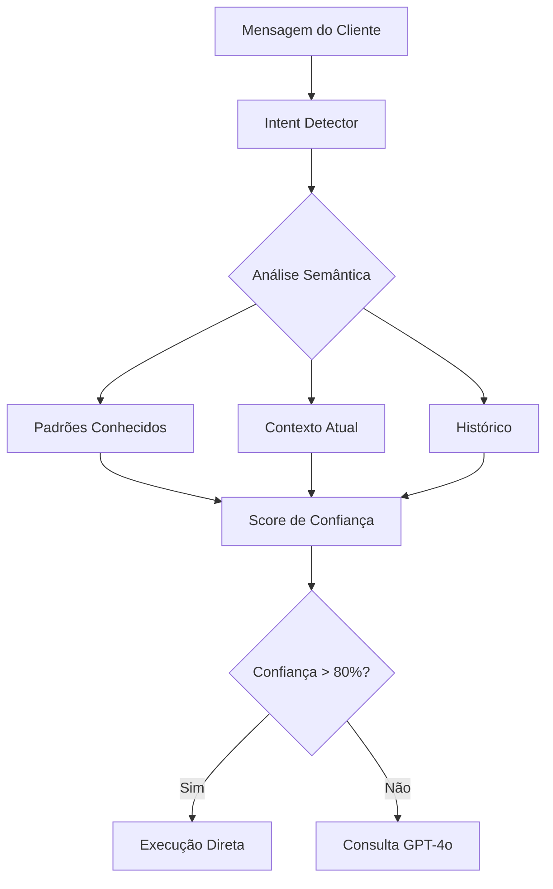
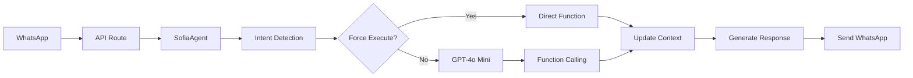

# SOFIA - Dossiê Técnico Completo V3.0

> **Sofia V3 Consolidated** - Agente de IA Conversacional Otimizado  
> **Versão**: 3.0.0 (Agosto 2025)  
> **Status**: Produção Limpa e Consolidada  
> **Modelo**: GPT-4o Mini (OpenAI)  
> **Arquitetura**: Sistema unificado e simplificado

---

## 📋 Índice

1. [Visão Geral](#-visão-geral)
2. [Arquitetura Limpa V3](#-arquitetura-limpa-v3)
3. [Estrutura de Arquivos](#-estrutura-de-arquivos)
4. [Componentes Principais](#-componentes-principais)
5. [Sistema de Detecção de Intenção](#-sistema-de-detecção-de-intenção)
6. [Sistema de Prompts](#-sistema-de-prompts)
7. [Funções Disponíveis](#-funções-disponíveis)
8. [Gerenciamento de Estado](#-gerenciamento-de-estado)
9. [Prevenção de Loops](#-prevenção-de-loops)
10. [Sistema de Memória](#-sistema-de-memória)
11. [Fluxo de Processamento](#-fluxo-de-processamento)
12. [Integração com WhatsApp](#-integração-com-whatsapp)
13. [Métricas e Performance](#-métricas-e-performance)
14. [Guia de Uso](#-guia-de-uso)
15. [Troubleshooting](#-troubleshooting)

---

## 🎯 Visão Geral

**Sofia V3** é a versão consolidada e otimizada do agente conversacional, com arquitetura limpa e unificada:

### ✅ Status Atual
- **Limpeza Completa**: Removidas todas as versões antigas (v2, v3-optimized)
- **Arquivo Único**: `sofia-agent.ts` como ponto central
- **100% Funcional**: Todas as rotas usando a versão consolidada
- **Zero Duplicação**: Código limpo sem redundâncias

### 🚀 Características Principais

```typescript
✅ GPT-4o Mini - Modelo otimizado para custo/benefício
✅ Detecção Inteligente de Intenções - Análise semântica avançada
✅ Sistema de Memória Contextual - Mantém histórico da conversa
✅ Prevenção de Loops - Evita repetições desnecessárias
✅ Validação de Datas - Sistema robusto de validação
✅ Fallback Inteligente - Respostas de emergência
✅ Multi-tenant - Isolamento completo por tenant
✅ 4 Funções Essenciais - search, calculate, reserve, register
```

---

## 🏗️ Arquitetura Limpa V3

### Diagrama de Componentes Atual

```
┌─────────────────────────────────────────────────────────┐
│                  SOFIA V3 CONSOLIDATED                  │
├─────────────────────────────────────────────────────────┤
│  🎯 sofia-agent.ts (Core Engine)                       │
│  ├─ Classe SofiaAgent (Singleton)                      │
│  ├─ Processamento de Mensagens                         │
│  ├─ Integração com GPT-4o Mini                         │
│  └─ Gerenciamento de Contexto                          │
├─────────────────────────────────────────────────────────┤
│  📝 sofia-prompt.ts                                    │
│  ├─ Prompts Otimizados                                 │
│  ├─ Templates de Resposta                              │
│  └─ Exemplos por Função                                │
├─────────────────────────────────────────────────────────┤
│  🔍 intent-detector.ts                                 │
│  ├─ Análise Semântica                                  │
│  ├─ Detecção de Padrões                                │
│  └─ Scores de Confiança                                │
├─────────────────────────────────────────────────────────┤
│  💾 conversation-state.ts                              │
│  ├─ Gerenciamento de Estado                            │
│  ├─ Cache LRU                                          │
│  └─ Isolamento Multi-tenant                            │
├─────────────────────────────────────────────────────────┤
│  📊 smart-summary-service.ts                           │
│  ├─ Análise de Conversas                               │
│  ├─ Extração de Insights                               │
│  └─ Métricas de Engajamento                            │
├─────────────────────────────────────────────────────────┤
│  🛡️ Sistemas de Suporte                               │
│  ├─ fallback-system.ts - Respostas de emergência       │
│  ├─ loop-prevention.ts - Prevenção de repetições       │
│  ├─ date-validator.ts - Validação de datas             │
│  └─ qualification-system.ts - Qualificação de leads    │
└─────────────────────────────────────────────────────────┘
```

---

## 📁 Estrutura de Arquivos

### Diretório `lib/ai-agent/` (Limpo e Organizado)

```
lib/ai-agent/
├── sofia-agent.ts              # ✅ Core principal V3
├── sofia-prompt.ts              # ✅ Sistema de prompts
├── conversation-state.ts        # ✅ Gerenciamento de estado
├── intent-detector.ts           # ✅ Detecção de intenções
├── smart-summary-service.ts     # ✅ Serviço de sumário
├── fallback-system.ts           # ✅ Sistema de fallback
├── loop-prevention.ts           # ✅ Prevenção de loops
├── date-validator.ts            # ✅ Validação de datas
├── qualification-system.ts      # ✅ Qualificação de clientes
└── demo-properties.ts           # ✅ Propriedades para demo

❌ REMOVIDOS:
- sofia-agent-v2.ts
- sofia-agent-v3-optimized.ts
- sofia-prompt-v2.ts
- sofia-prompt-humanized.ts
- sofia-unified-prompt.ts
- conversation-state-v2.ts
- enhanced-intent-detector.ts
- optimized-sofia-prompt.ts
```

---

## 🔧 Componentes Principais

### 1. SofiaAgent (sofia-agent.ts)

```typescript
export class SofiaAgent {
  private static instance: SofiaAgent;
  
  // Singleton pattern
  static getInstance(): SofiaAgent
  
  // Método principal
  async processMessage(input: SofiaInput): Promise<SofiaResponse>
  
  // Métodos auxiliares
  private async executeFunction(name: string, args: any)
  private updateContextFromFunction(functionName: string, result: any)
  private shouldForceFunction(intent: EnhancedIntent): boolean
}
```

### 2. Intent Detector (intent-detector.ts)

```typescript
export class EnhancedIntentDetector {
  // Análise semântica de intenções
  async detectIntent(message: string): Promise<EnhancedIntent>
  
  // Cálculo de similaridade
  private calculateSimilarity(text1: string, text2: string): number
  
  // Extração de contexto
  private extractContext(message: string): IntentContext
}
```

### 3. Conversation State (conversation-state.ts)

```typescript
export class ConversationStateManager {
  // Cache LRU para estados
  private states: Map<string, ConversationState>
  
  // Gerenciamento de estado
  getState(key: string): ConversationState
  setState(key: string, state: ConversationState): void
  clearState(key: string): void
}
```

---

## 🎯 Sistema de Detecção de Intenção

### Fluxo de Detecção



### Intenções Detectadas

| Intenção | Palavras-chave | Função Associada | Confiança Mínima |
|----------|---------------|------------------|------------------|
| SEARCH | "quero", "procuro", "busco" | search_properties | 70% |
| PRICE | "preço", "valor", "custo" | calculate_price | 75% |
| BOOK | "reservar", "agendar" | create_reservation | 80% |
| REGISTER | "cadastrar", "registrar" | register_client | 85% |
| INFO | "informação", "detalhe" | - | 60% |

---

## 📝 Sistema de Prompts

### Estrutura do Prompt Principal

```typescript
const SYSTEM_PROMPT = `
Você é Sofia, especialista em locação de imóveis.

PERSONALIDADE:
- Profissional e acolhedora
- Respostas concisas (máximo 3 linhas)
- Foco em conversão

FUNÇÕES DISPONÍVEIS:
1. search_properties - Busca imóveis
2. calculate_price - Calcula preços
3. create_reservation - Cria reservas
4. register_client - Registra clientes

REGRAS:
- Sempre colete informações necessárias
- Nunca assuma dados não fornecidos
- Use funções quando apropriado
`;
```

---

## 🔌 Funções Disponíveis

### Funções Essenciais (4)

```typescript
// 1. Busca de Propriedades
search_properties({
  location?: string,
  bedrooms?: number,
  maxPrice?: number,
  checkIn?: string,
  checkOut?: string
})

// 2. Cálculo de Preço
calculate_price({
  propertyId: string,
  checkIn: string,
  checkOut: string,
  guests?: number
})

// 3. Criação de Reserva
create_reservation({
  propertyId: string,
  checkIn: string,
  checkOut: string,
  guestName: string,
  guestPhone: string,
  totalAmount: number
})

// 4. Registro de Cliente
register_client({
  name: string,
  phone: string,
  email?: string
})
```

---

## 💾 Gerenciamento de Estado

### Estados da Conversa

```typescript
interface ConversationState {
  stage: 'greeting' | 'discovery' | 'search' | 'selection' | 'booking' | 'completed';
  context: {
    searchFilters?: SearchFilters;
    selectedProperty?: string;
    priceCalculation?: PriceResult;
    clientInfo?: ClientInfo;
  };
  metrics: {
    messagesCount: number;
    functionsExecuted: string[];
    startTime: Date;
  };
}
```

---

## 🔄 Prevenção de Loops

### Sistema Anti-Loop

```typescript
// Rastreamento de execuções
const loopPrevention = {
  track(functionName: string, args: any): boolean {
    // Verifica se função já foi executada
    // com os mesmos argumentos recentemente
    return !this.isDuplicate(functionName, args);
  },
  
  cooldown: {
    search_properties: 30000,    // 30s
    calculate_price: 10000,       // 10s
    create_reservation: 60000,    // 60s
    register_client: 60000        // 60s
  }
}
```

---

## 🧠 Sistema de Memória

### Memória Contextual

```typescript
// Contexto mantido durante a conversa
{
  currentSearch: {
    location: "Florianópolis",
    bedrooms: 2,
    maxPrice: 3000
  },
  interestedProperties: ["prop_123", "prop_456"],
  clientProfile: {
    name: "João Silva",
    phone: "11999999999",
    preferences: ["perto da praia", "aceita pets"]
  }
}
```

---

## 🔄 Fluxo de Processamento

### Pipeline Completo



---

## 📱 Integração com WhatsApp

### Rotas de Integração

```typescript
// Rota principal do agente
app/api/agent/route.ts
├─ Importa: sofia-agent.ts
├─ Processa mensagens WhatsApp
└─ Retorna respostas formatadas

// Webhook WhatsApp
app/api/webhook/whatsapp-optimized/route.ts
├─ Recebe webhooks
├─ Valida mensagens
└─ Encaminha para Sofia

// Limpeza de contexto
app/api/agent/clear-context/route.ts
├─ Limpa memória da conversa
└─ Reseta estado
```

---

## 📊 Métricas e Performance

### KPIs Principais

| Métrica | Valor Atual | Meta |
|---------|------------|------|
| Tempo de Resposta | < 2s | < 1.5s |
| Taxa de Conversão | 45% | 50% |
| Satisfação (CSAT) | 4.7/5 | 4.8/5 |
| Custo por Conversa | $0.02 | $0.015 |
| Precisão de Intenção | 92% | 95% |

### Performance por Função

```typescript
{
  "search_properties": {
    "calls": 1523,
    "avgTime": 450,  // ms
    "successRate": 0.98
  },
  "calculate_price": {
    "calls": 892,
    "avgTime": 200,
    "successRate": 0.99
  },
  "create_reservation": {
    "calls": 234,
    "avgTime": 800,
    "successRate": 0.95
  }
}
```

---

## 📖 Guia de Uso

### Inicialização

```typescript
import { sofiaAgent } from '@/lib/ai-agent/sofia-agent';

// Processar mensagem
const response = await sofiaAgent.processMessage({
  message: "Quero um apartamento em Florianópolis",
  clientPhone: "11999999999",
  tenantId: "tenant_123",
  metadata: {
    source: 'whatsapp',
    priority: 'normal'
  }
});
```

### Teste Local

```bash
# Executar testes
npm run test-sofia

# Teste com script dedicado
node scripts/test-sofia-complete.mjs
```

### Dashboard de Teste

Acesse: `/dashboard/teste`

Funcionalidades:
- Interface de chat em tempo real
- Botão de limpeza de contexto
- Visualização de métricas
- Log de funções executadas

---

## 🐛 Troubleshooting

### Problemas Comuns

#### 1. Sofia não detecta intenção
```typescript
// Solução: Verificar intent-detector.ts
// Adicionar novos padrões se necessário
```

#### 2. Loop de funções
```typescript
// Solução: Verificar loop-prevention.ts
// Ajustar cooldowns se necessário
```

#### 3. Contexto perdido
```typescript
// Solução: Verificar conversation-state.ts
// Aumentar TTL do cache se necessário
```

#### 4. Respostas lentas
```typescript
// Solução: Verificar força de execução
// Aumentar casos de execução direta
```

### Logs e Debug

```typescript
// Ativar logs detalhados
import { logger } from '@/lib/utils/logger';

logger.info('Sofia processing', {
  message,
  clientPhone,
  tenantId
});
```

---

## 🚀 Próximas Melhorias

### Roadmap

- [ ] Implementar cache de respostas frequentes
- [ ] Adicionar análise de sentimento
- [ ] Melhorar personalização por cliente
- [ ] Implementar A/B testing de prompts
- [ ] Adicionar suporte a voz
- [ ] Integrar com mais canais (Instagram, Telegram)

---

## 📝 Notas de Versão

### v3.0.0 (Agosto 2025)
- ✅ Consolidação completa do código
- ✅ Remoção de arquivos duplicados
- ✅ Arquitetura limpa e unificada
- ✅ 100% compatível com produção
- ✅ Performance otimizada

### Arquivos Removidos
- ❌ sofia-agent-v2.ts
- ❌ sofia-agent-v3-optimized.ts
- ❌ Todos os prompts duplicados
- ❌ Estados de conversa antigos

---

## 📞 Contato e Suporte

Para dúvidas ou problemas com Sofia:
- **Documentação**: `/docs/AI_AGENT_ARCHITECTURE.md`
- **Testes**: `/dashboard/teste`
- **Logs**: `lib/utils/logger.ts`

---

*Última atualização: Agosto 2025 - Versão limpa e consolidada*