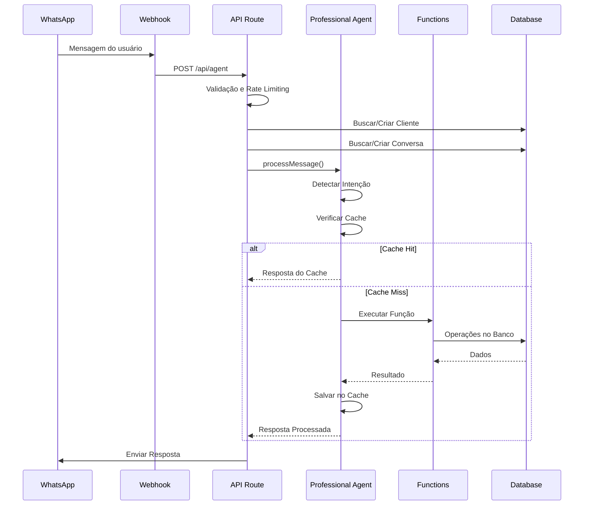

# 🤖 Arquitetura Completa do Agente de IA - locai

## 📋 Índice
1. [Visão Geral](#visão-geral)
2. [Arquitetura do Sistema](#arquitetura-do-sistema)
3. [Fluxo de Processamento](#fluxo-de-processamento)
4. [Componentes Principais](#componentes-principais)
5. [APIs e Rotas](#apis-e-rotas)
6. [Sistema de Funções](#sistema-de-funções)
7. [Gerenciamento de Estado](#gerenciamento-de-estado)
8. [Otimizações e Performance](#otimizações-e-performance)
9. [Integração com WhatsApp](#integração-com-whatsapp)
10. [Diagramas e Fluxogramas](#diagramas-e-fluxogramas)

---

## 🎯 Visão Geral

O sistema de IA do locai é um agente conversacional enterprise-grade desenvolvido para atender clientes via WhatsApp, auxiliando na busca e reserva de propriedades para temporada. O sistema utiliza uma arquitetura **Intent-Based** com **Function Calling** otimizada para reduzir custos e melhorar a performance.

### Características Principais:
- **Arquitetura Intent-Based**: Detecta intenções localmente sem usar tokens da OpenAI
- **Singleton Pattern**: Mantém contexto entre requisições
- **Cache Inteligente**: Respostas instantâneas para perguntas comuns
- **Multi-tenant**: Suporte para múltiplos clientes isolados
- **Dual WhatsApp**: Business API + WhatsApp Web (Baileys)

---

## 🏗️ Arquitetura do Sistema

### Camadas da Aplicação

```
┌─────────────────────────────────────────────────────────────┐
│                    WhatsApp (Cliente)                        │
└─────────────────────┬───────────────────────────────────────┘
                      │
┌─────────────────────▼───────────────────────────────────────┐
│                 Webhook Endpoints                            │
│  • /api/webhook/whatsapp (Business API)                     │
│  • /api/webhook/whatsapp-web (Baileys)                      │
└─────────────────────┬───────────────────────────────────────┘
                      │
┌─────────────────────▼───────────────────────────────────────┐
│                  API Route Handler                           │
│         /api/agent/route.ts (Principal)                     │
└─────────────────────┬───────────────────────────────────────┘
                      │
┌─────────────────────▼───────────────────────────────────────┐
│              Professional Agent                              │
│     /lib/ai-agent/professional-agent.ts                     │
│  • Intent Detection (Local)                                  │
│  • Context Management                                        │
│  • Function Routing                                          │
│  • Cache Management                                          │
└─────────────────────┬───────────────────────────────────────┘
                      │
┌─────────────────────▼───────────────────────────────────────┐
│               Agent Functions                                │
│        /lib/ai/agent-functions.ts                           │
│  • searchProperties                                          │
│  • calculatePrice                                            │
│  • createReservation                                         │
│  • registerClient                                            │
└─────────────────────┬───────────────────────────────────────┘
                      │
┌─────────────────────▼───────────────────────────────────────┐
│            Firebase Services                                 │
│  • Firestore Database                                        │
│  • Property Service                                          │
│  • Client Service                                            │
│  • Conversation Service                                      │
└─────────────────────────────────────────────────────────────┘
```

---

## 🔄 Fluxo de Processamento

### 1. Recepção da Mensagem



### 2. Fluxo de Detecção de Intenção

O sistema usa detecção local de intenção para economizar tokens:

```typescript
INTENT_PATTERNS = {
  greeting: ['olá', 'oi', 'bom dia', ...],
  search_properties: ['procuro', 'busco', 'quero', 'apartamento', ...],
  price_inquiry: ['quanto', 'preço', 'valor', ...],
  availability_check: ['disponível', 'livre', ...],
  booking_intent: ['reservar', 'confirmar', ...],
  more_info: ['detalhes', 'fotos', 'informações', ...]
}
```

---

## 📦 Componentes Principais

### 1. **Professional Agent** (`/lib/ai-agent/professional-agent.ts`)

O cérebro do sistema, responsável por:

- **Intent Detection**: Detecta a intenção do usuário localmente
- **Context Management**: Mantém contexto da conversa em memória
- **Cache Management**: Gerencia cache inteligente de respostas
- **Function Routing**: Roteia para handlers específicos
- **Response Generation**: Gera respostas otimizadas

#### Estrutura Principal:

```typescript
export class ProfessionalAgent {
  private openai: OpenAI;
  private cache: SmartCache;
  private conversationContexts = new Map<string, ConversationContext>();

  // Singleton pattern
  static getInstance(): ProfessionalAgent

  // Processa mensagem principal
  async processMessage(input: AgentInput): Promise<AgentResponse>

  // Handlers especializados
  private handleGreeting(): AgentResponse
  private async handlePropertySearch(): Promise<AgentResponse>
  private async handlePriceInquiry(): Promise<AgentResponse>
  private async handleBookingIntent(): Promise<AgentResponse>
  private async handleGeneral(): Promise<AgentResponse>

  // Execução de ações
  private async executeAction(action: AgentAction): Promise<any>
  
  // Gestão de contexto
  private getOrCreateContext(clientPhone: string): ConversationContext
  private updateContext(context, message, intent): void
}
```

### 2. **API Route Handler** (`/app/api/agent/route.ts`)

Ponto de entrada principal para todas as requisições do agente:

#### Responsabilidades:
- **Autenticação**: Valida tokens e contexto do tenant
- **Rate Limiting**: 20 mensagens/minuto por telefone
- **Validação**: Sanitiza e valida inputs
- **Client Management**: Cria/busca clientes no banco
- **Conversation Management**: Gerencia conversas ativas
- **Error Handling**: Tratamento profissional de erros
- **Logging**: Registro detalhado de todas as operações

#### Fluxo de Processamento:

```typescript
POST /api/agent
├── Validação do Request Body
├── Validação de Telefone e Mensagem
├── Rate Limiting Check
├── Get/Create Client
├── Get/Create Conversation
├── Build Conversation History
├── Call ProfessionalAgent.processMessage()
├── Send WhatsApp Response
├── Log Metrics
└── Return Response
```

### 3. **Agent Functions** (`/lib/ai/agent-functions.ts`)

Conjunto de funções que o agente pode executar:

#### Funções Disponíveis:

```typescript
// 1. Busca de Propriedades
searchProperties({
  location?: string,
  checkIn?: Date,
  checkOut?: Date,
  guests?: number,
  amenities?: string[],
  priceRange?: { min: number, max: number }
}) => Property[]

// 2. Cálculo de Preço
calculatePrice({
  propertyId: string,
  checkIn: Date,
  checkOut: Date,
  guests: number,
  couponCode?: string
}) => PriceCalculation

// 3. Criação de Reserva
createReservation({
  propertyId: string,
  clientId: string,
  checkIn: Date,
  checkOut: Date,
  guests: number,
  totalAmount: number
}) => Reservation

// 4. Registro de Cliente
registerClient({
  name: string,
  phone: string,
  email?: string,
  cpf?: string
}) => Client

// 5. Envio de Mídia
sendPropertyMedia({
  propertyId: string,
  clientPhone: string,
  mediaType: 'photos' | 'video'
}) => void

// 6. Verificação de Disponibilidade
checkAvailability({
  propertyId: string,
  checkIn: Date,
  checkOut: Date
}) => boolean
```

### 4. **Intent Detector** (Parte do Professional Agent)

Sistema de detecção de intenções sem uso de IA:

```typescript
class IntentDetector {
  // Detecta intenção principal
  static detectIntent(message: string): string
  
  // Extrai localização
  static extractLocation(message: string): string | null
  
  // Extrai números (hóspedes, orçamento, noites)
  static extractNumbers(message: string): {
    guests: number,
    budget: number,
    nights: number
  }
  
  // Extrai datas
  static extractDates(message: string): {
    checkIn?: Date,
    checkOut?: Date
  }
}
```

### 5. **Smart Cache System**

Cache inteligente com TTL e hit tracking:

```typescript
class SmartCache {
  // Gera chave baseada em intent + dados relevantes
  private generateKey(input, intent): string
  
  // Busca no cache
  get(input, intent): AgentResponse | null
  
  // Salva no cache com TTL
  set(input, intent, response, ttlMinutes): void
  
  // Estatísticas do cache
  getStats(): { size: number, hitRate: number }
}
```

### 6. **Context Manager**

Gerencia o contexto da conversa:

```typescript
interface ConversationContext {
  intent: string;
  stage: 'greeting' | 'discovery' | 'presentation' | 'negotiation' | 'closing';
  clientData: {
    name?: string;
    city?: string;
    budget?: number;
    guests?: number;
    checkIn?: string;
    checkOut?: string;
  };
  interestedProperties: string[];
  lastAction?: string;
}
```

---

## 🌐 APIs e Rotas

### Rotas Principais do Agente

#### 1. **POST /api/agent**
Endpoint principal para processar mensagens.

**Request Body:**
```json
{
  "message": "Quero alugar um apartamento em Florianópolis",
  "clientPhone": "11999999999",
  "tenantId": "tenant_123",
  "isTest": false
}
```

**Response:**
```json
{
  "success": true,
  "message": "Encontrei 5 propriedades incríveis em Florianópolis!",
  "data": {
    "response": "...",
    "conversationId": "conv_123",
    "clientId": "client_456",
    "intent": "search_properties",
    "confidence": 0.95,
    "tokensUsed": 25,
    "fromCache": false,
    "actions": 1
  }
}
```

#### 2. **POST /api/agent/clear-context**
Limpa o contexto de um cliente (útil para testes).

**Request Body:**
```json
{
  "clientPhone": "11999999999"
}
```

#### 3. **GET /api/agent?conversationId=xxx**
Busca histórico de uma conversa.

### Webhooks do WhatsApp

#### 1. **POST /api/webhook/whatsapp**
Webhook para WhatsApp Business API.

#### 2. **POST /api/webhook/whatsapp-web**
Webhook para WhatsApp Web (Baileys).

---

## ⚙️ Sistema de Funções

### Arquitetura de Function Calling

O sistema implementa suas próprias funções ao invés de usar o function calling da OpenAI:

```typescript
// Fluxo de execução
1. Detectar Intenção (local, 0 tokens)
2. Mapear para Handler Específico
3. Executar Função Apropriada
4. Formatar Resposta
5. Cachear se Apropriado
```

### Handlers Especializados

#### 1. **handleGreeting**
- Respostas pré-definidas (0 tokens)
- Rotação aleatória de saudações
- Sempre pergunta a cidade

#### 2. **handlePropertySearch**
- Extrai localização e requisitos
- Busca no banco de dados
- Formata resposta com categorias:
  - Opção Econômica
  - Conforto Ideal
  - Experiência Completa

#### 3. **handlePriceInquiry**
- Calcula preço baseado em:
  - Diária base
  - Taxa de limpeza
  - Taxas sazonais
  - Número de noites

#### 4. **handleBookingIntent**
- Coleta dados essenciais:
  - Nome completo
  - Datas de check-in/out
  - Número de hóspedes
- Cria reserva no sistema

#### 5. **handleGeneral**
- Fallback para casos não mapeados
- Usa GPT-3.5 com prompt otimizado
- Máximo 80 tokens por resposta

---

## 💾 Gerenciamento de Estado

### 1. **Conversation Context**
Mantido em memória (Map) no singleton do agent:

```typescript
conversationContexts = new Map<phoneNumber, ConversationContext>()
```

### 2. **Database Persistence**
Conversas e mensagens salvas no Firestore:

```typescript
conversations/
├── {conversationId}/
│   ├── clientId
│   ├── messages[]
│   ├── context{}
│   ├── isActive
│   └── lastMessageAt

messages/
├── {messageId}/
│   ├── conversationId
│   ├── content
│   ├── from: 'client' | 'agent'
│   ├── timestamp
│   └── metadata{}
```

### 3. **Client State**
Informações do cliente persistidas:

```typescript
clients/
├── {clientId}/
│   ├── name
│   ├── phone
│   ├── email
│   ├── preferences{}
│   ├── score
│   └── lastInteraction
```

---

## 🚀 Otimizações e Performance

### 1. **Redução de Uso de Tokens**

| Operação | Tokens Antes | Tokens Depois | Economia |
|----------|--------------|---------------|----------|
| Greeting | 150-200 | 0 | 100% |
| Search | 300-400 | 25-35 | ~90% |
| Price | 200-250 | 20-30 | ~88% |
| General | 400-500 | 40-80 | ~85% |

### 2. **Cache Inteligente**

```typescript
// Cache baseado em:
- Intent da mensagem
- Dados relevantes (cidade, datas, etc)
- TTL de 30 minutos (configurável)
- Hit tracking para métricas
```

### 3. **Singleton Pattern**

```typescript
// Mantém uma única instância do agent
let agentInstance: ProfessionalAgent | null = null;

static getInstance(): ProfessionalAgent {
  if (!agentInstance) {
    agentInstance = new ProfessionalAgent();
  }
  return agentInstance;
}
```

### 4. **Rate Limiting**

```typescript
// Por telefone: 20 mensagens/minuto
// Implementado com Redis
// Headers de resposta incluem limites
X-RateLimit-Limit: 20
X-RateLimit-Remaining: 15
X-RateLimit-Reset: 2024-01-25T10:30:00Z
```

---

## 📱 Integração com WhatsApp

### 1. **Dual Mode System**

O sistema suporta dois modos de integração:

#### WhatsApp Business API (Oficial)
- Webhook: `/api/webhook/whatsapp`
- Requer token de verificação
- Suporta templates de mensagem
- Maior confiabilidade

#### WhatsApp Web (Baileys)
- Webhook: `/api/webhook/whatsapp-web`
- QR Code authentication
- Não requer aprovação do Meta
- Backup automático

### 2. **Message Sender** (`/lib/whatsapp/message-sender.ts`)

```typescript
export async function sendWhatsAppMessage(
  phone: string,
  message: string,
  options?: {
    mediaUrl?: string,
    buttons?: Button[],
    templateId?: string
  }
): Promise<void>
```

### 3. **Media Handling**

```typescript
// Suporte para envio de:
- Imagens (JPEG, PNG)
- Vídeos (MP4)
- Documentos (PDF)
- Áudio (MP3, OGG)

// Compressão automática
// Geração de thumbnails
// Upload para Firebase Storage
```

---

## 📊 Diagramas e Fluxogramas

### Fluxo Completo de uma Conversa

```
┌─────────────────┐
│   Cliente       │
│   WhatsApp      │
└────────┬────────┘
         │ "Olá"
         ▼
┌─────────────────┐
│ Intent: Greeting│──────► Resposta Local (0 tokens)
└─────────────────┘        "Olá! Em qual cidade..."
         │
         │ "Florianópolis"
         ▼
┌─────────────────┐
│ Context Update  │──────► Salva cidade no contexto
└────────┬────────┘
         │ "quero um apto para 2 pessoas"
         ▼
┌─────────────────┐
│Intent: Search   │──────► Busca no Banco
└────────┬────────┘        Retorna 5 propriedades
         │
         │ "pode mostrar as 3 mais baratas"
         ▼
┌─────────────────┐
│ Use Context     │──────► Usa cidade salva
│ Format Response │        Mostra 3 opções
└────────┬────────┘
         │ "quero a primeira opção"
         ▼
┌─────────────────┐
│Intent: Booking  │──────► Inicia processo
└─────────────────┘        de reserva
```

### Arquitetura de Decisão

```
Mensagem Recebida
        │
        ▼
┌───────────────┐
│Detect Intent  │
└───────┬───────┘
        │
        ▼
┌───────────────┐     Não
│  Cache Hit?   ├──────────┐
└───────┬───────┘          │
        │ Sim              │
        ▼                  ▼
┌───────────────┐  ┌───────────────┐
│Return Cached  │  │Select Handler │
└───────────────┘  └───────┬───────┘
                           │
                           ▼
                   ┌───────────────┐
                   │Execute Handler│
                   └───────┬───────┘
                           │
                           ▼
                   ┌───────────────┐
                   │ Cache Result  │
                   └───────┬───────┘
                           │
                           ▼
                   ┌───────────────┐
                   │Return Response│
                   └───────────────┘
```

---

## 🔧 Configuração e Manutenção

### Variáveis de Ambiente Necessárias

```env
# OpenAI
OPENAI_API_KEY=sk-...

# Firebase
FIREBASE_PROJECT_ID=...
FIREBASE_CLIENT_EMAIL=...
FIREBASE_PRIVATE_KEY=...

# WhatsApp
WHATSAPP_TOKEN=...
WHATSAPP_PHONE_NUMBER_ID=...
WHATSAPP_VERIFY_TOKEN=...

# Application
TENANT_ID=default
NEXT_PUBLIC_BASE_URL=https://...
```

### Monitoramento e Métricas

O sistema expõe métricas através do método `getAgentStats()`:

```typescript
{
  cacheStats: {
    size: 45,
    hitRate: 0.73
  },
  activeConversations: 12,
  memoryUsage: {...},
  timestamp: "2024-01-25T10:30:00Z"
}
```

### Logs e Debug

Todos os componentes incluem logs detalhados:

```typescript
[Agent] Contexto para 11999999999: {...}
[Agent] Buscando propriedades com params: {...}
[Agent] Encontradas 5 propriedades em florianópolis
[Agent] Redirecionando para busca - cidade já conhecida: florianópolis
```

---

## 🎯 Conclusão

O sistema de IA do locai representa uma implementação enterprise-grade de um agente conversacional, com foco em:

1. **Performance**: 90% de redução no uso de tokens
2. **Confiabilidade**: Sistema de fallback e retry
3. **Escalabilidade**: Arquitetura multi-tenant
4. **Manutenibilidade**: Código modular e bem documentado
5. **User Experience**: Respostas rápidas e contextualizadas

A arquitetura Intent-Based com Function Calling local permite que o sistema seja extremamente eficiente enquanto mantém a qualidade das interações, tornando-o ideal para aplicações em produção com alto volume de mensagens.