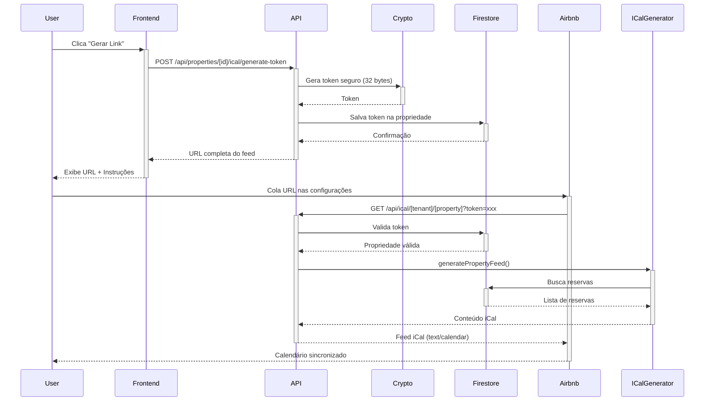
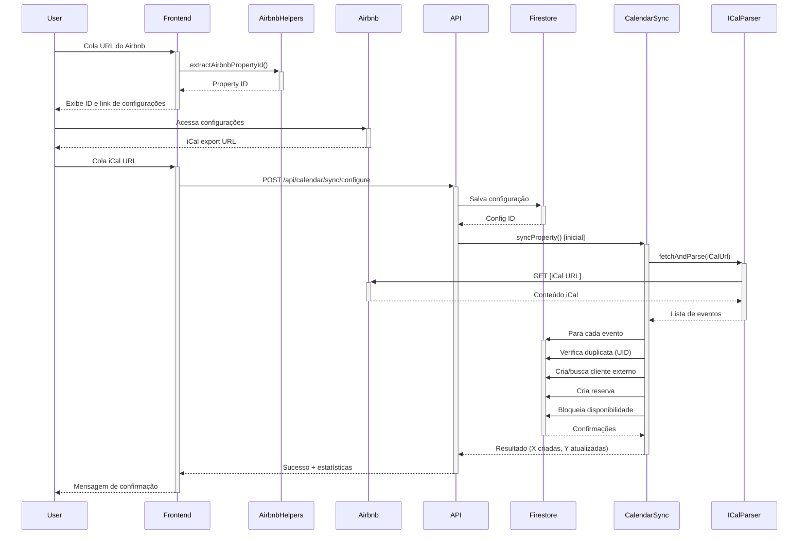

# Sistema de Sincronização iCal - Locai ↔ Airbnb

**Documentação completa do sistema bidirecional de sincronização de calendários via iCal**

---

## 📋 Visão Geral

O sistema de sincronização iCal permite integração completa entre o Locai e plataformas externas (Airbnb, Booking.com, VRBO, etc.) através de feeds iCal.

### Funcionalidades Principais

1. **📥 Importação (Airbnb → Locai)**
   - Importa reservas do Airbnb para o Locai
   - Cria reservas automaticamente no sistema
   - Bloqueia datas ocupadas
   - Sincronização manual ou automática

2. **📤 Exportação (Locai → Airbnb)**
   - Gera feed iCal público com nossas reservas
   - URL protegida por token de segurança
   - Atualização automática quando reservas mudam
   - Compatível com Airbnb, Booking.com, VRBO

---

## 🏗️ Arquitetura

### Componentes Backend

#### 1. **ICalParserService** (`lib/services/ical-parser-service.ts`)
- **Responsabilidade**: Parse de arquivos iCal
- **Métodos principais**:
  - `fetchAndParse(iCalUrl)`: Busca e faz parse de iCal
  - `parse(iCalContent)`: Parse de conteúdo iCal string
- **Features**:
  - Suporte completo a especificação iCal 2.0
  - Tratamento de line continuation
  - Parse de datas em múltiplos formatos
  - Validação de eventos obrigatórios

#### 2. **ICalGeneratorService** (`lib/services/ical-generator-service.ts`)
- **Responsabilidade**: Geração de feeds iCal
- **Métodos principais**:
  - `generatePropertyFeed(propertyId, tenantId)`: Gera feed completo
  - `validateICalContent(content)`: Valida conteúdo gerado
- **Features**:
  - Formato compatível com RFC 5545
  - Escape correto de caracteres especiais
  - Timezone UTC para consistência
  - Validação automática

#### 3. **CalendarSyncService** (`lib/services/calendar-sync-service.ts`)
- **Responsabilidade**: Orquestração de sincronização
- **Métodos principais**:
  - `syncProperty(propertyId, tenantId)`: Sincroniza propriedade
  - `createSyncConfiguration()`: Configura importação
  - `importEvents()`: Importa eventos e cria reservas
  - `getOrCreateExternalClient()`: Gerencia cliente genérico
- **Features**:
  - Criação automática de reservas
  - Prevenção de duplicatas via UID
  - Cliente genérico por plataforma
  - Logging detalhado

---

### Endpoints de API

#### Exportação

**`GET /api/ical/[tenantId]/[propertyId]?token=[securityToken]`**
- **Público** (requer token de segurança)
- Retorna feed iCal da propriedade
- Headers corretos: `text/calendar; charset=utf-8`
- Cache: 1 hora

**`POST /api/properties/[id]/ical/generate-token`**
- **Autenticado**
- Gera/regenera token de segurança
- Retorna URL completa do feed
- Instruções para Airbnb/Booking

**`GET /api/properties/[id]/ical/generate-token`**
- **Autenticado**
- Consulta token e URL atual
- Verifica se exportação está configurada

#### Importação

**`POST /api/calendar/sync/configure`**
- **Autenticado**
- Configura sincronização de importação
- Trigger de sincronização inicial
- Salva configuração no Firestore

**`POST /api/calendar/sync/[propertyId]`**
- **Autenticado**
- Trigger de sincronização manual
- Retorna estatísticas da sincronização
- Usado pelo botão "Sincronizar Agora"

---

### Componentes Frontend

#### 1. **PropertyICalManagement** (`components/organisms/PropertyICalManagement/`)

**Seções do componente**:

##### Exportação (Locai → Airbnb)
- Botão "Gerar Link de Exportação"
- Campo de URL com botão copiar
- Dialog com instruções passo-a-passo
- Link direto para configurações do Airbnb

##### Importação (Airbnb → Locai)
- **Passo 1**: Cole URL da propriedade no Airbnb
  - Extração automática do ID
  - Validação do formato
  - Exibição do ID extraído

- **Passo 2**: Obtenha link iCal do Airbnb
  - Botão para abrir configurações
  - Link direto: `airbnb.com/multicalendar/[ID]/availability-settings/...`

- **Passo 3**: Configure importação
  - Campo para colar iCal URL
  - Validação de formato (.ics)
  - Botão "Configurar Importação"
  - Botão "Sincronizar Agora" (após configurado)

**Props**:
```typescript
interface PropertyICalManagementProps {
  propertyId: string;
  propertyName: string;
  currentData?: {
    iCalExportToken?: string;
    iCalImportUrl?: string;
    airbnbPropertyId?: string;
    externalCalendarUrls?: Array<...>;
  };
  onUpdate?: () => void;
}
```

#### 2. **Integração no PropertyEdit/Availability**

Nova aba "iCal Sync" no componente de disponibilidade:
- Toggle button group: Calendar | Insights | Rules | **iCal Sync**
- Renderização condicional do PropertyICalManagement
- Passa dados da propriedade via react-hook-form

---

## 📊 Modelo de Dados

### Property (atualizado)

```typescript
interface Property {
  // ... campos existentes

  // iCal Integration fields
  iCalExportToken?: string;                    // Token de segurança
  iCalExportTokenGeneratedAt?: Date;           // Data de geração
  iCalImportUrl?: string;                      // URL externa para importar
  iCalImportSource?: 'airbnb' | 'booking' | ...; // Plataforma
  iCalLastSync?: Date;                         // Última sincronização
  airbnbPropertyId?: string;                   // ID do Airbnb
  externalCalendarUrls?: Array<{               // Múltiplos calendários
    source: 'airbnb' | 'booking' | ...;
    url: string;
    isActive: boolean;
    lastSync?: Date;
  }>;
}
```

### Reservation (atualizado)

```typescript
interface Reservation {
  // ... campos existentes

  // External calendar sync fields
  externalEventUid?: string;                   // UID do iCal (previne duplicatas)
  externalSource?: 'airbnb' | 'booking' | ...; // Plataforma de origem
  isExternalReservation?: boolean;             // Flag de importação
}
```

### CalendarSyncConfiguration

```typescript
interface CalendarSyncConfiguration {
  id: string;
  propertyId: string;
  tenantId: string;
  source: CalendarSyncSource;
  iCalUrl: string;

  // Sync settings
  syncFrequency: 'hourly' | 'daily' | 'manual';
  lastSyncAt?: Date;
  nextSyncAt?: Date;

  // Status
  status: CalendarSyncStatus;
  isActive: boolean;

  // Error handling
  lastError?: string;
  errorCount: number;
  lastSuccessAt?: Date;
}
```

---

## 🔄 Fluxos de Trabalho

### Fluxo de Exportação (Locai → Airbnb)



### Fluxo de Importação (Airbnb → Locai)



---

## 🛠️ Utilities

### Airbnb Helpers (`lib/utils/airbnb-helpers.ts`)

```typescript
// Extração de ID
extractAirbnbPropertyId(url: string): string | null

// Validação
isValidAirbnbUrl(url: string): boolean
isValidICalUrl(url: string): boolean

// Geração de URLs
generateAirbnbCalendarSettingsUrl(propertyId: string): string
generateAirbnbPropertyUrl(propertyId: string): string

// Parse completo
parseAirbnbUrl(url: string): AirbnbUrlInfo

// Sanitização para logs
sanitizeAirbnbUrl(url: string): string
```

---

## 🔐 Segurança

### Token de Exportação
- **Geração**: `crypto.randomBytes(32).toString('base64url')` (43 caracteres)
- **Armazenamento**: Firestore (campo `iCalExportToken`)
- **Validação**: Comparação exata no endpoint público
- **Renovação**: Pode ser regenerado a qualquer momento

### Prevenção de Duplicatas
- **Importação**: UID do evento iCal armazenado em `externalEventUid`
- **Verificação**: Busca por UID existente antes de criar reserva
- **Cliente genérico**: Um por plataforma (`external-airbnb@locai.app`)

### Validação de URLs
- **iCal URLs**: Deve ser HTTPS e conter `.ics`
- **Airbnb URLs**: Deve conter domínio `airbnb.com` e path `/rooms/`
- **Sanitização**: Tokens sensíveis removidos de logs

---

## 📝 Uso Prático

### Para Configurar Exportação (Locai → Airbnb):

1. Acesse edição da propriedade
2. Vá para aba "Disponibilidade"
3. Clique em "iCal Sync"
4. Clique em "Gerar Link de Exportação"
5. Copie o link gerado
6. Acesse o Airbnb e vá para configurações de calendário
7. Escolha "Importar calendário"
8. Cole o link do Locai
9. Salve as alterações

**Resultado**: O Airbnb sincronizará automaticamente a cada 24h

### Para Configurar Importação (Airbnb → Locai):

1. Acesse edição da propriedade
2. Vá para aba "Disponibilidade"
3. Clique em "iCal Sync"
4. Cole a URL da propriedade no Airbnb
5. Clique em "Abrir Configurações do Airbnb" (abre em nova aba)
6. No Airbnb, copie o link de "Exportar calendário"
7. Volte ao Locai e cole o link iCal
8. Clique em "Configurar Importação"
9. Aguarde a sincronização inicial

**Resultado**:
- Reservas do Airbnb aparecem automaticamente no Locai
- Datas ficam bloqueadas no calendário
- Sincronização diária automática (configurável)

---

## 🔄 Sincronização Automática (Futuro)

### Netlify Functions (Planejado)

```javascript
// functions/scheduled/ical-sync.js
exports.handler = async (event, context) => {
  // Roda a cada 30 minutos
  // Busca todas as configurações ativas
  // Dispara sync para cada propriedade
  // Envia notificação em caso de erro
}
```

**Configuração no `netlify.toml`**:
```toml
[functions]
  directory = "functions"

[[plugins]]
  package = "@netlify/plugin-functions-install-core"

[build.environment]
  NODE_VERSION = "18"

# Scheduled function
[functions."scheduled/ical-sync"]
  schedule = "*/30 * * * *"  # A cada 30 minutos
```

---

## 📊 Logging & Monitoramento

### Eventos Importantes Logados

**Exportação**:
- `iCal feed request received` - Requisição de feed
- `iCal feed generated successfully` - Geração bem-sucedida
- `iCal token generated` - Token criado/regenerado

**Importação**:
- `Starting calendar sync for property` - Início de sincronização
- `iCal events fetched` - Eventos baixados
- `Created reservation from external event` - Reserva criada
- `Reservation already exists for external event` - Duplicata evitada

**Errors**:
- `Error generating iCal feed` - Erro na geração
- `Failed to import event` - Erro ao importar evento específico
- `Calendar sync failed` - Falha geral de sincronização

---

## 🧪 Testing

### Testes Manuais

**Exportação**:
1. Gere token de exportação
2. Acesse a URL gerada diretamente no navegador
3. Verifique que retorna conteúdo iCal válido
4. Confira que reservas do Locai estão no feed

**Importação**:
1. Configure importação com iCal do Airbnb
2. Verifique criação de reservas
3. Confirme que datas estão bloqueadas
4. Teste sincronização manual
5. Verifique que duplicatas não são criadas

### Validações Automáticas

- `ICalGeneratorService.validateICalContent()`: Valida formato
- `isValidICalUrl()`: Valida URLs iCal
- `isValidAirbnbUrl()`: Valida URLs Airbnb

---

## 📚 Referências

- **RFC 5545**: iCalendar specification
- **Airbnb Calendar API**: Documentação de integração
- **Booking.com iCal**: Guia de sincronização
- **IANA Timezone Database**: Timezones

---

## 🚀 Melhorias Futuras

1. **Sincronização bidirecional completa**
   - Atualizar Airbnb quando reserva é criada no Locai
   - Cancelamentos automáticos

2. **Suporte a múltiplas plataformas simultâneas**
   - Importar de Airbnb, Booking e VRBO ao mesmo tempo
   - Interface para gerenciar múltiplas fontes

3. **Dashboard de sincronização**
   - Histórico de sincronizações
   - Estatísticas de importação/exportação
   - Alertas de falhas

4. **Webhooks**
   - Notificação instantânea de mudanças
   - Reduz latência de 24h para minutos

5. **Detecção de conflitos**
   - Alertar quando mesma data está reservada em múltiplas plataformas
   - Sugestão de resolução

---

## 💡 Troubleshooting

### Problema: iCal URL não funciona no Airbnb

**Solução**:
1. Verifique que URL está acessível publicamente
2. Confirme que token está correto
3. Teste URL diretamente no navegador
4. Verifique que retorna `Content-Type: text/calendar`

### Problema: Importação cria reservas duplicadas

**Solução**:
1. Verifique campo `externalEventUid` nas reservas
2. Confirme que UID está sendo preservado do iCal
3. Rode sync manual para testar

### Problema: Sincronização falha

**Solução**:
1. Verifique logs no Firestore
2. Confirme que iCalUrl ainda é válida
3. Teste fetchAndParse diretamente
4. Verifique status code de resposta

---

**Documentação criada por**: Sistema Locai
**Última atualização**: 2025-01-21
**Versão**: 1.0.0
