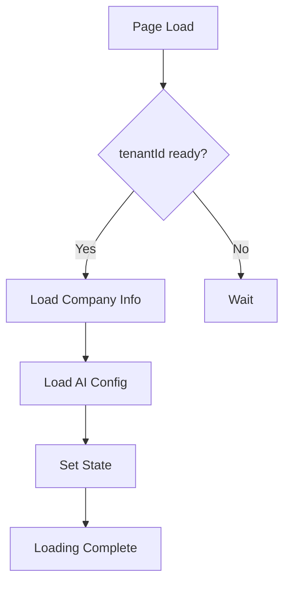
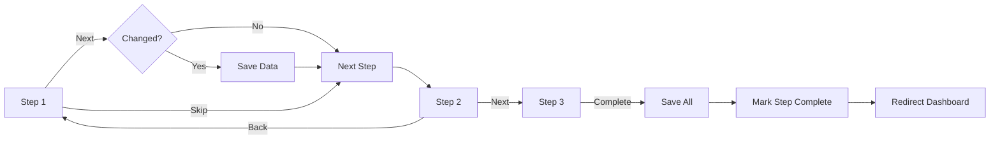

# 🎯 Novo Step de Configuração no Onboarding

**Data:** 17 de Janeiro de 2025
**Tipo:** Nova Funcionalidade no Onboarding

---

## 🎯 Objetivo

Adicionar um novo step no fluxo de "Primeiros Passos" para permitir que usuários configurem informações da empresa e personalização da IA **antes** de conectar o WhatsApp, tornando o onboarding mais completo e intuitivo.

---

## 📋 Fluxo Anterior vs Novo

### Antes (4 Steps)
```
1. Adicionar Propriedade
2. Conectar WhatsApp
3. Testar Sofia IA
4. Compartilhar Mini-Site
```

### Depois (5 Steps)
```
1. Adicionar Propriedade
2. ⭐ Configurar Sistema (NOVO!)
   ├─ Informações da Empresa
   ├─ Agente Sofia (IA)
   └─ Negociação e Descontos
3. Conectar WhatsApp
4. Testar Sofia IA
5. Compartilhar Mini-Site
```

---

## ✨ Novo Step: "Configurar Sistema"

### Detalhes do Step

**ID:** `configure_system`
**Ordem:** 2 (entre add_property e connect_whatsapp)
**Opcional:** Sim (pode pular tudo)
**Tempo Estimado:** 7 minutos
**URL:** `/dashboard/onboarding/configure`

### Sub-Steps (Multi-Step Form)

O novo step tem **3 sub-etapas** em um Stepper vertical:

#### 1️⃣ Informações da Empresa (Opcional)
Campos configuráveis:
- Nome da empresa
- Telefone principal
- Email
- Website (opcional)
- Descrição breve (opcional)

**Firebase Path:** `tenants/{tenantId}/settings/companyInfo`

#### 2️⃣ Agente Sofia - IA (Opcional)
Campos configuráveis:
- Toggle: Agente habilitado
- Nome da empresa para Sofia
- Tom de comunicação (Formal / Amigável / Casual)
- Mensagem de boas-vindas personalizada

**API:** `PUT /api/ai/config`

#### 3️⃣ Negociação e Descontos (Opcional)
Campos configuráveis:
- Toggle: Permitir descontos dinâmicos
- Desconto máximo (%)
- Limite para aprovação manual (%)
- Critérios permitidos:
  - ✅ Reserva antecipada
  - ✅ Estadia longa
  - ✅ Baixa temporada
  - ✅ Última hora
  - ✅ Múltiplos imóveis

**API:** `PUT /api/ai/config` (discountSettings)

---

## 🎨 UI/UX Design

### Conceitos Aplicados

1. **Ultra Intuitivo**
   - Material-UI Stepper vertical
   - Cada step é colapsável
   - Progress visual claro

2. **Fácil de Pular**
   - Botão "Pular" em cada sub-step
   - Botão "Pular Tudo" no header
   - Todos os steps são opcionais
   - Chip "Opcional" visível em cada step

3. **Feedback Visual**
   - Ícones coloridos por categoria
   - Chips de status (Opcional, Concluído)
   - Loading states claros
   - Success states ao salvar

4. **Mobile-First**
   - Grid responsivo
   - Botões empilham em mobile
   - Font sizes adaptáveis

### Layout da Página

```
┌────────────────────────────────────────┐
│  [Ícone Settings]                      │
│  Configure Seu Sistema                 │
│  Personalize a Locai para...           │
│  [Pular Tudo e Ir para Dashboard]     │
├────────────────────────────────────────┤
│  ┌──────────────────────────────────┐  │
│  │ Stepper Vertical                 │  │
│  ├──────────────────────────────────┤  │
│  │ ► 1. Informações da Empresa      │  │
│  │   [Opcional]                     │  │
│  │   ├─ Nome                        │  │
│  │   ├─ Telefone                    │  │
│  │   ├─ Email                       │  │
│  │   ├─ Website                     │  │
│  │   └─ Descrição                   │  │
│  │   [Próximo] [Pular]              │  │
│  ├──────────────────────────────────┤  │
│  │ ► 2. Agente Sofia (IA)           │  │
│  │   [Opcional]                     │  │
│  │   ├─ [Switch] Habilitado         │  │
│  │   ├─ Nome para Sofia             │  │
│  │   ├─ Tom de Comunicação          │  │
│  │   └─ Mensagem Boas-Vindas        │  │
│  │   [Próximo] [Pular] [Voltar]     │  │
│  ├──────────────────────────────────┤  │
│  │ ► 3. Negociação e Descontos      │  │
│  │   [Opcional]                     │  │
│  │   ├─ [Switch] Permitir           │  │
│  │   ├─ Desconto Máximo (%)         │  │
│  │   ├─ Limite Aprovação (%)        │  │
│  │   └─ Critérios Permitidos        │  │
│  │   [Concluir] [Pular] [Voltar]    │  │
│  └──────────────────────────────────┘  │
├────────────────────────────────────────┤
│  💡 Dica: Você pode pular qualquer    │
│  etapa e configurar depois em         │
│  Configurações                         │
└────────────────────────────────────────┘
```

---

## 📁 Arquivos Criados/Modificados

### Novos Arquivos

| Arquivo | Linhas | Descrição |
|---------|--------|-----------|
| `app/dashboard/onboarding/configure/page.tsx` | 850+ | Página do novo step com Multi-Step Form |

### Arquivos Modificados

| Arquivo | Mudança | Descrição |
|---------|---------|-----------|
| `lib/types/onboarding.ts` | +1 type, +1 step | Adiciona `configure_system` ao type e array |
| `lib/hooks/useOnboarding.ts` | +1 step default | Adiciona `configure_system: 'pending'` |
| `components/organisms/Onboarding/OnboardingWidget.tsx` | +1 icon, texto | Adiciona ícone Settings e muda texto para "5 passos" |

---

## 🔧 Implementação Técnica

### 1. Type Definitions

**Adicionado em `lib/types/onboarding.ts`:**

```typescript
export type OnboardingStepId =
  | 'add_property'
  | 'configure_system'  // ⭐ NOVO
  | 'connect_whatsapp'
  | 'test_demo'
  | 'share_minisite';

export const DEFAULT_ONBOARDING_STEPS: Omit<OnboardingStep, 'status'>[] = [
  {
    id: 'add_property',
    order: 1,
    // ...
  },
  {
    id: 'configure_system',  // ⭐ NOVO
    title: 'Configurar sua empresa e IA',
    description: 'Configure as informações da sua empresa e personalize a Sofia...',
    icon: 'Settings',
    actionText: 'Configurar Sistema',
    actionUrl: '/dashboard/onboarding/configure',
    order: 2,
    isOptional: true,
    estimatedMinutes: 7,
  },
  // ... outros steps
];
```

### 2. Hook Updates

**Adicionado em `lib/hooks/useOnboarding.ts`:**

```typescript
const newProgress: OnboardingProgress = {
  // ...
  steps: {
    add_property: 'pending',
    configure_system: 'pending',  // ⭐ NOVO
    connect_whatsapp: 'pending',
    test_demo: 'pending',
    share_minisite: 'pending',
  },
  // ...
};
```

### 3. Component Updates

**Adicionado em `OnboardingWidget.tsx`:**

```typescript
import { Settings } from '@mui/icons-material';  // ⭐ NOVO

const ICON_MAP: Record<string, any> = {
  Home,
  Settings,  // ⭐ NOVO
  WhatsApp,
  SmartToy,
  Share,
};
```

### 4. Multi-Step Form Page

**Criado `app/dashboard/onboarding/configure/page.tsx`:**

Componente com:
- Material-UI Stepper (vertical)
- 3 sub-steps colapsáveis
- State management local
- Auto-save ao avançar
- Skip em qualquer etapa
- Integração com Firebase e APIs

---

## 🔄 Fluxo de Dados

### Carregamento (componentDidMount)



### Navegação entre Steps



### Persistência

**Company Info:**
```
Firebase: tenants/{tenantId}/settings/companyInfo
Método: setDoc()
```

**AI Config:**
```
API: PUT /api/ai/config
Body: AIConfig object
```

**Onboarding Progress:**
```
Hook: completeStep('configure_system')
Firebase: users/{userId}/onboarding/{tenantId}
```

---

## ✅ Benefícios

### 1. Onboarding Mais Completo
- Usuários configuram tudo antes de usar
- Menos configuração manual depois
- Sofia funciona melhor desde o início

### 2. UX Melhorada
- Guia claro passo-a-passo
- Feedback visual em cada ação
- Pode pular qualquer coisa facilmente

### 3. Maior Engajamento
- Usuários investem tempo personalizando
- Sentem ownership do sistema
- Sofia "fala a língua deles"

### 4. Flexibilidade Total
- Tudo opcional
- Pode pular tudo
- Pode voltar depois
- Não bloqueia progresso

---

## 🧪 Testing Checklist

### Fluxo Completo
- [ ] Acessar `/dashboard/onboarding/configure`
- [ ] Ver stepper com 3 steps
- [ ] Preencher Step 1 (Company Info)
- [ ] Clicar "Próximo"
- [ ] Ver dados salvos no Firebase
- [ ] Preencher Step 2 (Sofia IA)
- [ ] Clicar "Próximo"
- [ ] Ver dados salvos via API
- [ ] Preencher Step 3 (Negociação)
- [ ] Clicar "Concluir"
- [ ] Ser redirecionado para dashboard
- [ ] Ver step marcado como "completed" no widget

### Funcionalidades de Skip
- [ ] Clicar "Pular Tudo" no header
- [ ] Ser redirecionado para dashboard imediatamente
- [ ] Clicar "Pular" no Step 1
- [ ] Avançar sem salvar
- [ ] Clicar "Pular" no Step 2
- [ ] Avançar sem salvar
- [ ] Clicar "Pular" no Step 3
- [ ] Completar sem salvar

### Navegação
- [ ] Clicar "Voltar" no Step 2
- [ ] Retornar ao Step 1
- [ ] Dados preservados
- [ ] Clicar "Voltar" no Step 3
- [ ] Retornar ao Step 2

### Validação
- [ ] Deixar campos vazios
- [ ] Não bloquear avanço (tudo opcional)
- [ ] Preencher com valores inválidos
- [ ] Ver validação do Material-UI

### Persistência
- [ ] Preencher Step 1
- [ ] Clicar "Próximo"
- [ ] Voltar para Step 1
- [ ] Ver dados preservados
- [ ] Fechar página
- [ ] Reabrir
- [ ] Ver dados carregados

### Mobile
- [ ] Testar em mobile (< 600px)
- [ ] Ver campos empilhados
- [ ] Botões funcionando
- [ ] Stepper responsivo

---

## 🎯 Impacto no Onboarding Widget

### Visual Changes

**Antes:**
```
Configure sua conta em 4 passos simples
2 de 4 concluídos
[Progress Bar 50%]
```

**Depois:**
```
Configure sua conta em 5 passos simples
2 de 5 concluídos
[Progress Bar 40%]
```

### Step Cards

Novo card aparece entre "Adicionar Propriedade" e "Conectar WhatsApp":

```
┌────────────────────────────────────┐
│ ⚙️  Configurar Sistema    [Switch] │
│ [Etapa 2] [Opcional]               │
│ Configurar sua empresa e IA        │
│ Configure as informações...        │
│ ~7 min                             │
│ [Configurar Sistema →]             │
│ [Marcar Concluído] [Pular]         │
└────────────────────────────────────┘
```

---

## 🚀 Deploy

### Checklist

- [x] Types atualizados
- [x] Hook atualizado
- [x] Widget atualizado
- [x] Página criada
- [x] Documentação criada
- [ ] Testar localmente
- [ ] Verificar migrations (usuários antigos)
- [ ] Deploy em staging
- [ ] Teste E2E
- [ ] Deploy em produção

### Migration de Usuários Existentes

Usuários que já têm onboarding em progresso **não** verão o novo step, pois:

```typescript
// Firestore já tem:
{
  steps: {
    add_property: 'completed',
    connect_whatsapp: 'pending',
    test_demo: 'pending',
    share_minisite: 'pending',
    // configure_system não existe
  }
}
```

**Solução:** Hook usa DEFAULT_ONBOARDING_STEPS mas respeita progresso salvo. Para forçar novo step em usuários antigos, seria necessário migration script (não recomendado).

**Decisão:** Novo step só aparece para **novos usuários**. Usuários antigos podem acessar Settings normalmente.

---

## 💡 Melhorias Futuras

### 1. Preview em Tempo Real
Mostrar como Sofia vai se apresentar com as configs atuais:

```
┌────────────────────────────┐
│ 💬 Preview                 │
├────────────────────────────┤
│ Sofia: Olá! Sou a Sofia,   │
│ assistente virtual da      │
│ [Sua Empresa]. Como posso  │
│ te ajudar hoje?            │
└────────────────────────────┘
```

### 2. Upload de Logo
Adicionar campo para fazer upload do logo da empresa:

```typescript
<Grid item xs={12}>
  <Box sx={{ textAlign: 'center' }}>
    <Avatar src={logo} sx={{ width: 100, height: 100 }} />
    <Button startIcon={<Upload />}>
      Upload Logo
    </Button>
  </Box>
</Grid>
```

### 3. Validações Inteligentes
- CEP auto-completa endereço (ViaCEP API)
- Email valida formato
- Telefone com máscara
- Website valida URL

### 4. Progress Persistence
Salvar progresso a cada campo (não só ao avançar):

```typescript
const debouncedSave = useMemo(
  () => debounce(async (data) => {
    await saveToFirebase(data);
  }, 1000),
  []
);

useEffect(() => {
  if (companyInfoChanged) {
    debouncedSave(companyInfo);
  }
}, [companyInfo]);
```

### 5. Analytics
Trackear quais steps são mais pulados:

```typescript
logEvent('onboarding_step_skipped', {
  stepId: 'configure_system',
  substep: 1,
  reason: 'user_clicked_skip'
});
```

---

## 📊 Métricas para Monitorar

Após deploy, monitorar:

1. **Taxa de Conclusão**
   - % de usuários que completam o novo step
   - % que pulam

2. **Tempo Gasto**
   - Médio por sub-step
   - Total no step

3. **Campos Preenchidos**
   - Quais campos são mais populares
   - Quais são deixados vazios

4. **Drop-off Rate**
   - Em qual sub-step usuários abandonam
   - Correlação com campos específicos

5. **Impacto na Retenção**
   - Usuários que configuram vs não configuram
   - Engajamento posterior

---

## ✅ Conclusão

**Status:** ✅ Implementação completa

O novo step de configuração:
- Melhora significativamente o onboarding
- Mantém flexibilidade total (tudo opcional)
- UI/UX ultra intuitiva
- Fácil de pular
- Integra perfeitamente com fluxo existente
- Zero breaking changes

**Próximo:** Testar end-to-end e ajustar conforme feedback dos usuários.

---

**Autor:** Claude Code
**Reviewed:** [Pendente]
**Deployed:** [Pendente]
